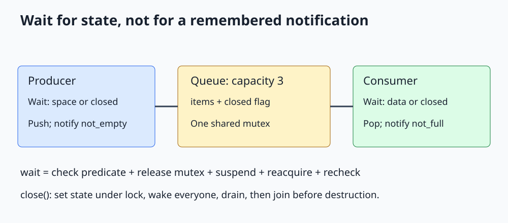

# C++ std::condition_variable

**Wait for a shared-state predicate without polling, then recheck it while holding the mutex.**



Open [the diagram](../images/std_condition_variable.svg). The complete program is [std_condition_variable.cpp](../cpp_examples/std_condition_variable.cpp).

## 1. Why isn't a mutex enough?

A mutex answers, "May I access the queue now?" It does not answer, "Is there anything to consume?" Repeatedly locking and checking an empty queue wastes CPU. Sleeping between checks adds latency and still does not establish a correct coordination protocol.

A condition variable lets a thread suspend until it should recheck shared state. The condition variable is not the state itself: the queue and `closed_` flag carry that information.

The example has a producer in main and an asynchronous consumer. Its queue holds at most three integers. A full queue slows the producer, a form of **backpressure**.

## 2. The state and its predicates

| Waiter | Predicate allowing progress | Action after waking |
|---|---|---|
| Producer | `closed_ || items_.size() < 3` | Reject if closed, otherwise append |
| Consumer | `closed_ || !items_.empty()` | Pop an item, or finish if closed and empty |

One mutex protects the deque and the closed flag. Every concurrent access to either uses that mutex. Separate condition variables let a producer wake consumers and a consumer wake producers.

## 3. Understand the consumer wait

```cpp
std::unique_lock<std::mutex> lock(mutex_);
not_empty_.wait(lock, [&] { return closed_ || !items_.empty(); });
if (items_.empty())
{
    return std::nullopt;
}
```

The predicate overload behaves like a loop that tests the predicate and waits while it is false. A wait atomically releases the mutex and enters the waiting state. Before returning, it reacquires the mutex.

This unlock-and-wait protocol prevents a producer following the same mutex protocol from slipping a state change into a gap between the consumer's check and its wait.

`std::unique_lock` is required because waiting must temporarily unlock and relock. A `lock_guard` has no such interface. The ordinary `condition_variable` works with a `unique_lock<std::mutex>`; `condition_variable_any` supports other suitable lock types and C++20 stop-aware waits.

## 4. Spurious wakeups and lost notifications

A wait may unblock even without a matching notification. This is a **spurious wakeup**. Another consumer can also take the item before this consumer reacquires the mutex. Either way, waking does not establish that an item is available; the predicate must be checked again.

A notification is not a stored token. If it happens before anybody waits, it does not remain queued. That is safe here because the producer stores the item under the mutex. A later consumer sees the state and does not wait.

The pattern is: change state under the mutex, then notify. Notifying after unlocking is often useful because the awakened thread needs the mutex anyway. Notifying while holding it is also valid, but may make the awakened thread immediately block again.

## 5. Producer and bounded capacity

```cpp
not_full_.wait(lock, [&] { return closed_ || items_.size() < 3; });
if (closed_)
{
    return false;
}
items_.push_back(value);
lock.unlock();
not_empty_.notify_one();
```

The capacity check and insertion happen under one uninterrupted ownership period. If we unlocked between them, multiple producers could observe available space and exceed the bound.

After popping, a consumer calls `not_full_.notify_one()` because one slot has become available. The capacity is fixed to three to keep this lesson focused.

## 6. Shutdown is part of the protocol

`close()` sets `closed_` while locked, then notifies **both** wait sets. Blocked producers return false; consumers drain existing items and return `std::nullopt` only when no items remain.

Closing is not the same as destroying. Main waits for the consumer before allowing the queue, mutex, and condition variables to be destroyed. Destroying them while a worker is still using them is invalid.

Main also closes the queue if producer-side insertion throws, so the waiting consumer can exit during unwinding. This integer-only example assumes ordinary mutex/wait operations succeed and consumer summation cannot throw. A generic multi-consumer queue needs an explicit policy for consumer failure and interrupted operations.

## 7. Timed waits

For a deadline, use the predicate overload of `wait_until()` with a `steady_clock` deadline. Its Boolean result reports the predicate evaluation, not a promise that a notification occurred.

Repeatedly calling a duration-based `wait_for()` in a hand-written loop can restart the whole timeout after every wakeup. Use one deadline when the entire operation has a fixed time budget. See [timed locking](Std_Timed_Mutex_Guide.md) for the distinction between a timeout and a hard real-time guarantee.

## 8. Build and expected output

From the repository root:

```sh
mkdir -p /tmp/cpp-threading
g++ -std=c++17 -Wall -Wextra -Wpedantic -pthread threading/cpp_examples/std_condition_variable.cpp -o /tmp/cpp-threading/std_condition_variable
/tmp/cpp-threading/std_condition_variable
```

```text
Consumed sum: 55
Closed and drained: true
```

The sum is `1 + 2 + ... + 10 = 55`. Exit code `0` additionally checks that a closed queue rejects pushes and that a drained queue returns no value. The program works whether the consumer starts early or late; no sleeps are needed.

## 9. Check your understanding

**Why include `closed_` in the full-queue predicate?** Otherwise a producer could remain blocked forever during shutdown when nobody will remove another item.

**Why notify all on close?** Every waiter must get a chance to observe the terminal state, not just one consumer.

**Can the consumer read `closed_` outside the mutex?** Not in this design. That would race with `close()` and break the shared predicate protocol.

**Does notify_one transfer the mutex to a waiter?** No. A selected waiter must still reacquire it; neither fairness nor immediate execution is promised.