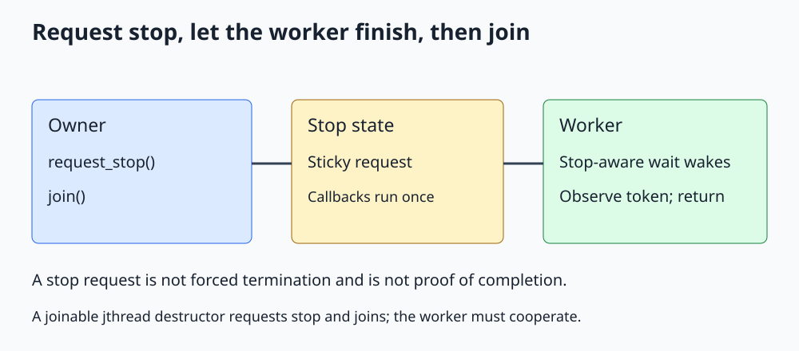

# C++ std::jthread and Cooperative Cancellation

**Own a thread with RAII and request cancellation through a stop-aware protocol.**



Open [the diagram](../images/std_jthread.svg). The complete C++20 program is [std_jthread.cpp](../cpp_examples/std_jthread.cpp).

## 1. What problem does jthread solve?

Destroying a joinable `std::thread` terminates the process. C++20 `std::jthread`, from `<thread>`, is an owning alternative: when still joinable at destruction, it requests stop and then joins.

That makes many scope-exit and exception-unwinding paths easier to manage. It does not forcibly terminate a worker, catch an escaping worker exception, or guarantee fast destruction.

## 2. The cancellation vocabulary

| Type or operation | Responsibility |
|---|---|
| `std::stop_source` | Own the ability to request stop on a shared stop state |
| `std::stop_token` | Observe whether that stop state has been requested |
| `std::stop_callback` | Register a callback for a stop request |
| `jthread::request_stop()` | Request stop through the thread owner's associated source |

The stop types are declared in `<stop_token>`. Multiple tokens can refer to one state. A stop request is sticky: once requested, that state cannot be reset to not-stopped.

If a jthread callable accepts a stop token in the supported leading-argument position, jthread supplies its token. It also supports callables that do not accept a token, but those callables must have some other completion path.

## 3. A stop-aware blocking worker

```cpp
std::jthread worker([&](std::stop_token token)
{
    std::unique_lock<std::mutex> lock(mutex);
    const bool work_ready = changed.wait(lock, token, [] { return false; });
    stop_observed = !work_ready && token.stop_requested();
});
```

This uses `std::condition_variable_any`, whose C++20 predicate wait overload accepts a stop token. The ordinary `condition_variable` does not offer that overload.

The predicate is deliberately always false because this lesson isolates cancellation of an idle worker. A real queue predicate would normally be `!queue.empty()` or a shutdown condition.

The stop-aware wait releases the mutex while suspended and reacquires it before returning. Its Boolean result reports the predicate, not simply whether a notification occurred. Here the only normal exit is a stop request, so `work_ready` is false.

## 4. No startup sleep is necessary

Main can request stop before the worker begins waiting or while it is waiting. The stop state persists, so both orders work.

```cpp
const bool first_request = worker.request_stop();
const bool second_request = worker.request_stop();
worker.join();
```

The first call returns true because it makes the first successful request. The second returns false because stop was already requested. Neither return value means the worker has finished. Joining establishes completion before main reads the ordinary `stop_observed` result.

The explicit join makes the output point clear. If that join were omitted, a still-joinable jthread would request stop and join at scope exit.

## 5. Callback behavior

The program registers a callback that increments an atomic count. Stop callbacks are invoked synchronously as part of requesting stop; registration after a request can invoke the callback immediately in the registering thread.

Do not assume a callback runs on the worker thread. Keep callbacks short and nonthrowing. An exception escaping a stop callback terminates the process.

Avoid holding a mutex when requesting stop if a callback might try to acquire it. Synchronous callback execution can otherwise deadlock the requesting thread. Callback destruction can also wait for an invocation running elsewhere to complete, so lifetime ordering matters.

## 6. Cooperative does not mean forced

A worker must check its token, use a stop-aware wait, or otherwise cooperate. A blocking socket read or ordinary mutex acquisition is not automatically interrupted by a stop token.

Do not assume `request_stop()` releases locks or rolls back a partly completed update. The worker chooses a safe stopping point and preserves its invariants before returning.

If both work availability and stop are observed together, application policy decides whether to drain queued work or cancel immediately. The wait's predicate result alone is not a complete queue shutdown policy.

## 7. Destruction and member ordering

Objects captured by reference must outlive the worker. Class members are destroyed in reverse declaration order, so an owning jthread is commonly declared after the state it uses, or explicitly stopped and joined in the destructor before that state is destroyed.

Do not destroy a worker owner from its own worker thread: joining yourself cannot succeed. Do not hold a lock needed by the worker while allowing the owner to join.

Worker exceptions still need explicit capture or a future-based result channel. The example's worker performs no deliberately throwing application work, but jthread does not make arbitrary callables exception-safe.

## 8. Build and expected output

From the repository root, using a C++20 standard library:

```sh
mkdir -p /tmp/cpp-threading
g++ -std=c++20 -Wall -Wextra -Wpedantic -pthread threading/cpp_examples/std_jthread.cpp -o /tmp/cpp-threading/std_jthread
/tmp/cpp-threading/std_jthread
```

```text
Worker observed stop: true
Stop callbacks: 1
First / second request: true / false
```

Exit code `0` checks observation, one callback invocation, and sticky stop-request behavior. The protocol works even when the request arrives before the wait starts.

## 9. Check your understanding

**Does jthread destruction guarantee an immediate exit?** No. It joins, so it can block indefinitely if the worker cannot or will not finish.

**Can a stopped token be reused to start fresh work?** It still reports stopped. Create a new stop state for an independent cancellation lifetime.

**Why not notify an ordinary condition variable after setting an unrelated atomic stop flag?** Without a carefully coordinated predicate/wait protocol, a notification can be missed. Use the stop-aware overload or protect the predicate and waiting protocol consistently.