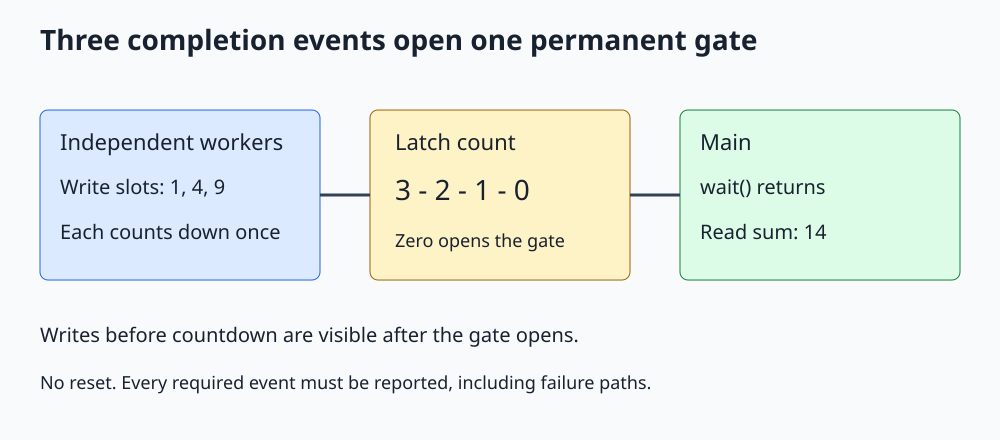

# C++ std::latch

**Wait until a fixed number of events have completed, once.**



Open [the diagram](../images/std_latch.svg). The complete C++20 program is [std_latch.cpp](../cpp_examples/std_latch.cpp).

## 1. Why use a countdown latch?

An application may need to wait until three independent preparations finish before using their results. A latch represents the number of unfinished events. Each completion reduces that count; reaching zero opens the gate permanently.

`std::latch` is declared in `<latch>` and was added in C++20. It is one-shot: it cannot be reset for another round.

A latch count represents events, not necessarily threads. One thread can report several events, or several threads can report one event each.

## 2. Divide the output into independent slots

The program allocates three result slots and a latch with count three:

```cpp
std::array<int, 3> results{};
std::latch finished{3};
```

Each worker owns a distinct slot, computes a square, and then counts down:

```cpp
const int value = static_cast<int>(index) + 1;
results[index] = value * value;
finished.count_down();
```

The squares are 1, 4, and 9. These separate ordinary `int` array elements may be written concurrently. Main does not read them until the latch wait completes.

This reasoning does not automatically extend to bit-packed proxy containers such as `std::vector<bool>`, whose logical elements may share underlying storage.

## 3. The three main operations

| Operation | Meaning |
|---|---|
| `count_down(update)` | Report completed events without waiting; default update is one |
| `wait()` | Block until the count reaches zero without decrementing it |
| `arrive_and_wait(update)` | Decrement and then wait for zero |

`try_wait()` checks whether the latch is already open without blocking. Once zero is reached, waits can complete without another round of countdowns.

Do not decrement by more than the remaining count. In this example, exactly three workers each decrement once. Main calls only `wait()`, so it must not be included as a fourth completion event.

## 4. Visibility after wait

```cpp
finished.wait();
const int total = results[0] + results[1] + results[2];
```

The latch synchronization makes writes preceding the workers' countdowns visible after the waiting operation unblocks. The sum is therefore safely read before main receives the individual future results.

The example later calls `get()` on every worker future to finish handling their execution lifetime. A latch opening means the declared events have happened, not necessarily that all reporting threads have exited.

## 5. Events must be reported on every required path

If a worker returns or throws before its required countdown, main can wait forever. A latch does not automatically know that a worker failed.

For throwing work, catch the failure, store an exception or error result, and ensure the required countdown still happens through a scope guard or a carefully controlled exit path. Then let the coordinator inspect errors after the gate opens.

The example's worker uses only small integer arithmetic, a distinct-slot assignment, and countdown. It contains no deliberately throwing application operation before reporting completion.

The async handles are stored in a fixed array. If worker creation fails, main unwinds instead of entering the latch wait; already started workers do not wait on the latch and their futures are destroyed before the shared state. A different launch/start-gate design needs its own failure handling.

## 6. Latch versus related tools

| Tool | Best fit |
|---|---|
| Latch | One group of completion events opens a gate once |
| Barrier | A fixed participant group coordinates repeated phases |
| Semaphore | Reusable available permits or signals |
| Condition variable | An arbitrary predicate over mutex-protected shared state |
| Future | A result or exception from an individual producer |

Use a future when you want the result and error channel more than a group-level event gate. Use a barrier for repeated simulation iterations; see the [barrier lesson](Std_Barrier_Guide.md).

## 7. Build and expected output

From the repository root:

```sh
mkdir -p /tmp/cpp-threading
g++ -std=c++20 -Wall -Wextra -Wpedantic -pthread threading/cpp_examples/std_latch.cpp -o /tmp/cpp-threading/std_latch
/tmp/cpp-threading/std_latch
```

```text
Sum of squares: 14
Latch open: true
```

Exit code `0` checks `1 + 4 + 9 = 14` and the final open state. There are no timing assumptions about completion order.

## 8. Check your understanding

**Why not initialize the latch to the number of CPUs?** Its count describes required events, which are three here. Hardware capacity is unrelated to that accounting.

**Does count_down wait for the other workers?** No. Use `arrive_and_wait()` if that participant must also wait.

**Can we call count_down again after zero to begin another round?** No. A latch cannot reset; use a barrier or a fresh latch with a new lifetime.

**Can the latch be destroyed as soon as main sees zero?** Only when no other thread can still access it. The example waits for all worker executions before shared objects leave scope.