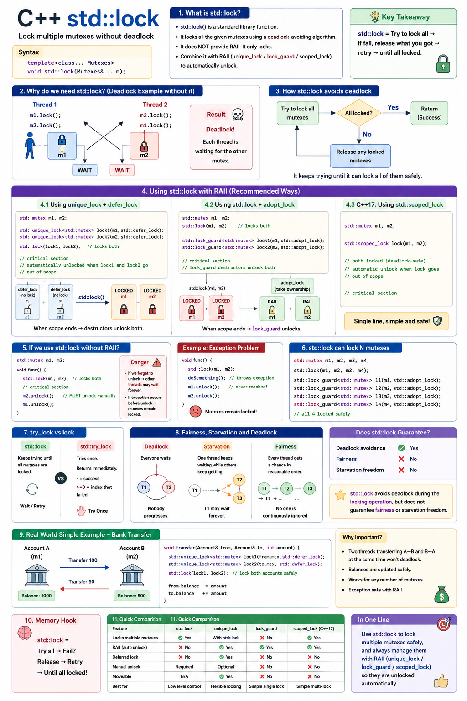

# C++ std::lock

**Acquire multiple mutexes without an acquisition-order deadlock. Use RAII to release them.**



Open [the image](../images/std_lock.png) for a larger view. The existing toggle-based example is [std_lock.cpp](../cpp_examples/std_lock.cpp). Section 10 explains its current limitations; the complete program below fixes those issues for this lesson.

## 1. Why do we need std::lock?

Imagine two accounts: Pavan has `50000`, and Sagar has `60000`. Two threads transfer money in opposite directions:

- Thread 1 transfers `500` from Pavan to Sagar.
- Thread 2 transfers `600` from Sagar to Pavan.

Each account has its own mutex. A transfer changes **both** balances, so it must protect both accounts throughout the balance check and updates.

Locking only the sender does not protect the recipient from another thread. Acquiring and releasing the two account locks separately would also expose an incomplete transfer to other code that reads both balances.

### 1.1. Locking the sender first can deadlock

```text
Thread 1                              Thread 2
--------                              --------
locks Pavan's mutex                   locks Sagar's mutex
tries to lock Sagar's mutex            tries to lock Pavan's mutex
waits for Thread 2                     waits for Thread 1
                  neither can proceed
```

Each thread holds one resource and waits for a resource held by the other. Neither reaches its unlock operation. This circular wait is a **deadlock**.

The order "sender first, recipient second" sounds consistent, but sender and recipient refer to different objects in the two calls. What matters is the order of the actual mutexes, not the parameter names.

### 1.2. Data race and deadlock are different bugs

| Problem | What happens? | Typical remedy |
|---|---|---|
| Data race | Conflicting unsynchronized accesses to shared memory, with at least one write, cause undefined behavior | Protect every relevant access with an appropriate synchronization protocol |
| Deadlock | Threads cannot proceed because they wait on one another | Avoid circular acquisition dependencies |

Adding locks can remove a data race and still introduce a deadlock. Correct code must address both.

`std::lock` is declared in `<mutex>`. It acquires two or more lockable objects using a deadlock-avoidance algorithm. After a successful return, all supplied locks have been acquired.

**It does not acquire all mutexes in one indivisible atomic instruction.** Intermediate locking and unlocking can occur. Do not read or modify the protected state until the call has returned successfully.

## 2. A complete bank-transfer example

This C++17 program uses the same accounts and amounts as the existing source. It checks the balance only after acquiring both locks, rejects self-transfers, and prints after both workers finish.

```cpp
#include <iostream>
#include <mutex>
#include <string>
#include <thread>
#include <utility>

struct Account
{
    std::string name;
    int balance;
    std::mutex balance_mutex;

    Account(std::string account_name, int initial_balance)
        : name(std::move(account_name)), balance(initial_balance)
    {
    }
};

bool transfer(Account& from, Account& to, int amount)
{
    if (&from == &to || amount <= 0)
    {
        return false;
    }

    std::unique_lock<std::mutex> from_lock(from.balance_mutex, std::defer_lock);
    std::unique_lock<std::mutex> to_lock(to.balance_mutex, std::defer_lock);
    std::lock(from_lock, to_lock);

    if (from.balance < amount)
    {
        return false;
    }

    from.balance -= amount;
    to.balance += amount;
    return true;
}

int main()
{
    Account pavan{"Pavan", 50000};
    Account sagar{"Sagar", 60000};

    std::thread first_worker([&] { transfer(pavan, sagar, 500); });
    std::thread second_worker;
    try
    {
        second_worker = std::thread([&] { transfer(sagar, pavan, 600); });
    }
    catch (...)
    {
        first_worker.join();
        throw;
    }

    first_worker.join();
    second_worker.join();

    std::cout << pavan.name << ": " << pavan.balance << '\n';
    std::cout << sagar.name << ": " << sagar.balance << '\n';
    std::cout << "Total: " << pavan.balance + sagar.balance << '\n';

    const bool self_rejected = !transfer(pavan, pavan, 100);
    const bool zero_rejected = !transfer(pavan, sagar, 0);
    const bool negative_rejected = !transfer(pavan, sagar, -100);
    const bool insufficient_rejected = !transfer(pavan, sagar, 100000);

    return pavan.balance == 50100 && sagar.balance == 59900
        && self_rejected && zero_rejected && negative_rejected
        && insufficient_rejected ? 0 : 1;
}
```

Output:

```text
Pavan: 50100
Sagar: 59900
Total: 110000
```

Either transfer can happen first. Both have sufficient funds in either order, and the final arithmetic is the same:

- Pavan: `50000 - 500 + 600 = 50100`.
- Sagar: `60000 + 500 - 600 = 59900`.
- Total: `50100 + 59900 = 110000`.

The program returns `0` only when the final balances are correct and self-transfers, nonpositive amounts, and insufficient funds are rejected without changing those balances.

The account fields are public to keep the example focused; all concurrent balance access here goes through `transfer()`. Production code should enforce that discipline through its interface. This lesson also assumes small amounts and omits integer-overflow checks, persistence, and real banking transaction requirements.

The construction-time `try` block joins the first worker if creating the second thread fails. It does not catch exceptions escaping a worker function; an uncaught worker exception still terminates the process. General applications need an explicit worker error-reporting strategy.

## 3. Understand the three locking lines

```cpp
std::unique_lock<std::mutex> from_lock(from.balance_mutex, std::defer_lock);
std::unique_lock<std::mutex> to_lock(to.balance_mutex, std::defer_lock);
std::lock(from_lock, to_lock);
```

### 3.1. std::unique_lock is an ownership wrapper

The mutex is the actual synchronization object. A `std::unique_lock` refers to a mutex and tracks whether it currently owns the lock.

When an owning `unique_lock` is destroyed, it unlocks its mutex automatically. This is RAII: tie cleanup to an object's lifetime so normal returns and exception unwinding release the resource.

A `unique_lock` can exist without owning its mutex. That ability is central to this pattern.

### 3.2. std::defer_lock means "associate now, acquire later"

Without `std::defer_lock`, constructing each `unique_lock` immediately locks its mutex. Two such constructors would put us back in the sender-first acquisition sequence that can deadlock.

With `defer_lock`, both wrappers start non-owning. Constructing them does not protect the balances yet.

### 3.3. std::lock coordinates acquisition

`std::lock(from_lock, to_lock)` calls the wrappers' locking operations. `unique_lock` provides `lock()`, `try_lock()`, and `unlock()`, so it satisfies the needed lockable interface.

| Point in execution | from_lock owns its mutex? | to_lock owns its mutex? |
|---|---|---|
| After both deferred constructors | No | No |
| Inside `std::lock` | Ownership can change as acquisition proceeds | Ownership can change as acquisition proceeds |
| After successful `std::lock` return | Yes | Yes |
| After the wrappers leave scope | Mutex released | Mutex released |

Do not call `std::lock` on these wrappers after already locking them yourself. The intended inputs in this pattern are non-owning wrappers referring to distinct mutexes.

## 4. What does deadlock avoidance guarantee?

Conceptually, an implementation can acquire one lock, try another, and release acquired locks before retrying when it cannot obtain the whole set. The exact sequence is unspecified; do not depend on a particular backoff algorithm or lock order.

For valid uses such as the two competing account transfers, the coordinated acquisition avoids the circular wait caused by independently locking the same mutex set in different orders.

It does not promise fairness, a bounded completion time, or freedom from every possible deadlock in your program. A mutex held forever by unrelated code can still block progress. Dependencies involving locks held before the call, callbacks, other resources, or later waits require their own analysis.

If a locking operation throws, `std::lock` unlocks the objects it acquired during that call before rethrowing. After successful acquisition, the `unique_lock` destructors handle later scope-exit cleanup.

`std::lock` itself returns `void`: successful return means acquisition succeeded, not that it returns a guard object.

## 5. The balance check belongs inside the critical section

This ordering is wrong for shared balances:

```cpp
if (from.balance < amount)
{
    return false;
}
std::lock(from_lock, to_lock);
```

The read can race with a different transfer writing the same balance. Even a separately synchronized earlier check would not be enough if the balance could change before the updates: a successful check must remain valid through the transaction.

The correct order is:

```cpp
std::lock(from_lock, to_lock);
if (from.balance < amount)
{
    return false;
}
from.balance -= amount;
to.balance += amount;
```

Now the check and both changes occur while both account mutexes remain locked. Other code following the same locking protocol cannot access either protected balance in conflict with the transfer.

The early return for insufficient funds is safe: both local `unique_lock` objects are destroyed, releasing their mutexes. No manual unlock is needed.

The self-transfer and positive-amount checks can happen before locking because they inspect object identity and a local argument, not the concurrently modified balances.

## 6. Why reject a self-transfer?

If `from` and `to` are the same account, both wrappers refer to the same non-recursive mutex. Supplying that mutex twice is not a valid way to use this multi-lock pattern; `std::lock` does not deduplicate mutexes for you.

The guide chooses to reject a self-transfer before constructing the wrappers. Another application could define it as a successful no-op. What matters for locking is detecting the identical object before trying to acquire its mutex twice.

Different account names or equal balances do not establish identity. `&from == &to` checks whether the references name the same object.

## 7. std::lock versus std::scoped_lock

For the common case "lock these mutexes until the end of this scope," C++17 offers a shorter RAII form:

```cpp
std::scoped_lock account_locks(from.balance_mutex, to.balance_mutex);
```

With multiple mutexes, `scoped_lock` uses deadlock-avoiding acquisition as if by `std::lock`, and its destructor releases them. Keep the same self-transfer guard and perform the balance check after this declaration.

| Tool | Acquires the mutexes? | Releases them at scope exit? | Typical use |
|---|---|---|---|
| `std::lock` | Yes, coordinating multiple lockables | No, not by itself | Acquisition algorithm used with ownership wrappers |
| `std::unique_lock` + `defer_lock` | Not during construction | Yes, if it later owns the lock | Deferred acquisition or flexible lock ownership |
| `std::scoped_lock` | Yes, during construction | Yes | Simple scope-bound multi-mutex protection |
| `std::lock_guard` | Normally acquires one mutex | Yes | Simple scope-bound single-mutex protection |

Prefer `scoped_lock` for straightforward C++17 multi-mutex code. Learning `std::lock` with deferred `unique_lock` still matters: it explains ownership and supports cases requiring capabilities such as explicit unlocking or moving the wrapper.

Do not use two independent single-mutex `scoped_lock` declarations as a substitute for one declaration containing both mutexes. Separate declarations do not coordinate acquisition.

## 8. What about std::adopt_lock?

Another valid pattern locks raw mutexes first and then transfers responsibility for unlocking to guards:

```cpp
std::lock(from.balance_mutex, to.balance_mutex);
std::lock_guard<std::mutex> from_guard(from.balance_mutex, std::adopt_lock);
std::lock_guard<std::mutex> to_guard(to.balance_mutex, std::adopt_lock);
```

`adopt_lock` means "the current thread already owns this mutex; do not lock it again." The guard assumes responsibility for unlocking at destruction.

| Tag | Mutex state expected when constructing the wrapper | Constructor acquires the mutex? |
|---|---|---|
| `std::defer_lock` | Ownership is not acquired yet | No |
| `std::adopt_lock` | Current thread already owns the mutex | No |

Do not use `adopt_lock` on an unlocked mutex. Do not put work that can throw between raw acquisition and constructing the guards. Deferred `unique_lock` is a useful teaching pattern because the wrappers are established before coordinated acquisition.

Do not mix the patterns by locking raw mutexes while expecting deferred wrappers to track those operations. A wrapper must acquire through its own operations, or explicitly adopt an already-held lock.

## 9. Waiting, fairness, and lock ordering

`std::lock` is not a "return immediately if busy" operation. It can wait until it acquires the full set.

`std::try_lock` is a different algorithm: it tries the lockables in order, returns `-1` on success, or returns the zero-based index of the unsuccessful acquisition after releasing earlier acquisitions from that call. A failed `try_lock` can be spurious for types such as `std::mutex`; failure is not proof that another thread owns the lock.

Another deadlock-avoidance strategy is a global lock order: every operation acquires account mutexes according to the same stable ordering, such as immutable unique account IDs. It only works if every relevant path follows that rule. "Sender first" is not a global order.

Keep critical sections short. Do not wait on a future or join a thread while holding a mutex that its worker needs. Avoid calling unknown callbacks while holding locks: the callback can introduce dependencies not visible at the call site.

## 10. Read the existing toggle-based example carefully

The existing [std_lock.cpp](../cpp_examples/std_lock.cpp) deliberately contrasts opposite-order locking with coordinated acquisition. These details matter when using it for learning:

| Existing detail | What it means |
|---|---|
| `USE_STD_LOCK` is `1` | Uses coordinated acquisition for the pair of deferred wrappers |
| `USE_STD_LOCK` is `0` | Locks the sender, sleeps, then locks the recipient; deadlock is possible |
| Balance check precedes acquisition | The shared read can race with another transfer; the overall example is not race-free merely because `std::lock` is enabled |
| Comments say "atomically" and "no deadlock possible" | Read these narrowly: acquisition is coordinated, not one atomic operation or a guarantee about every program dependency |
| No self-transfer guard | Calling it with the same account twice violates the distinct-mutex requirement of this pattern |
| Public `print()` does not lock | Current transfer calls print while holding both locks; calling it elsewhere concurrently would need protection |
| Sleep in the unsafe branch | Makes the problematic schedule more likely, but does not guarantee it |
| `<bits/stdc++.h>` | GCC-specific convenience header; the complete guide example uses standard headers |

This guide does not modify that source file. Use the complete program in section 2 when studying the corrected balance-check placement and input guards.

Sleeping is not synchronization. Running the unsafe branch once without hanging does not prove it correct, and repeatedly running the corrected example does not by itself prove the absence of all concurrency bugs.

## 11. Build and run the existing example

From the workspace root, with GCC and the current `USE_STD_LOCK = 1` setting:

```sh
mkdir -p out
g++ -std=c++17 -Wall -Wextra -pthread threading/cpp_examples/std_lock.cpp -o out/std_lock
./out/std_lock
```

These commands run the original source, including its caveats above. Its prints occur during the transfers, so intermediate balances depend on which worker acquires the locks first. Do not treat that source as a verified race-free reference.

If deliberately experimenting with `USE_STD_LOCK = 0`, use a terminal timeout or stop a hung process with Ctrl+C. No particular sleep duration guarantees that the threads will deadlock.

### 11.1. Compile the corrected program directly from this guide

The first C++ block is the complete program. The following shell command extracts just that block and compiles it without creating another source file:

```sh
mkdir -p out
awk '/^```cpp$/ { in_example = 1; next } in_example && /^```$/ { exit } in_example { print }' threading/readme_files/Std_Lock_Guide.md |
    g++ -x c++ -std=c++17 -Wall -Wextra -Werror -pthread -o out/std_lock_guide -
./out/std_lock_guide
```

Expected output is the three lines in section 2. Exit status `0` means the final balances and rejection checks passed.

## 12. How this differs from future-based examples

In the [promise/future guide](Std_Promise_Future_Guide.md) and [async guide](Std_Async_Guide.md), a worker calculates using account copies and main receives a result. Main alone applies the balances.

Here, workers modify the original accounts directly. They need a protocol that protects those shared balances, not just a channel for returning a result.

| Requirement | Relevant tool |
|---|---|
| Protect shared data | Mutex plus a consistent access protocol |
| Acquire several mutexes without acquisition-order deadlock | `std::lock` or multi-mutex `std::scoped_lock` |
| Deliver one value or exception | `std::promise` / `std::future` |
| Invoke a function and receive its eventual outcome | `std::async` |

These tools are complementary. An async task that modifies shared accounts may still need locks. Having a future does not protect concurrent access to those accounts before the task finishes.

## 13. Check your understanding

### Q1. Why can "always lock the sender first" deadlock?

**Answer:** The sender is Pavan in one call and Sagar in the other. Each thread can hold a different first mutex and wait for the other's second mutex. The parameter order is consistent, but the actual mutex order is opposite.

### Q2. Does constructing a unique_lock with defer_lock protect the account?

**Answer:** No. The wrapper knows which mutex it refers to but does not own it yet. Access the protected balance only after acquisition succeeds.

### Q3. Who unlocks after std::lock returns?

**Answer:** `std::lock` does not create a scope guard. In the guide example, the two owning `unique_lock` destructors release the mutexes when `transfer()` exits.

### Q4. Does returning early for insufficient funds leak the locks?

**Answer:** No. Returning destroys both local wrappers, which unlock their mutexes. This is why the ownership wrappers matter.

### Q5. Why not check the balance first to reduce time under the lock?

**Answer:** The unlocked read can race with a write. Even a separately protected earlier check can become stale before the update. The funds check and changes must occur under the same uninterrupted locking interval.

### Q6. Can std::lock acquire the same std::mutex twice?

**Answer:** Do not supply the same non-recursive mutex twice. Detect self-transfers first; the algorithm does not remove duplicate inputs.

### Q7. Is std::lock an atomic operation on all supplied mutexes?

**Answer:** No. Its implementation can lock, try, unlock, and retry. Successful return guarantees that all supplied locks are acquired, not that every acquisition happened simultaneously.

### Q8. Why prefer scoped_lock for simple C++17 code?

**Answer:** A single declaration provides both coordinated acquisition and scope-bound release. Deferred `unique_lock` is useful when you need more flexible ownership operations.

### Q9. Can I use adopt_lock instead of defer_lock before std::lock?

**Answer:** No. `adopt_lock` assumes the current thread already owns the mutex. `defer_lock` deliberately leaves ownership unacquired so the subsequent algorithm can acquire it.

### Q10. Why does main print without acquiring the account locks in section 2?

**Answer:** Both workers have been joined, so they no longer access the accounts. Successful joins also synchronize their prior writes with main. Printing earlier while workers might write would require protection.

### Q11. Will the corrected program always transfer Pavan's money first?

**Answer:** No. Acquisition order is nondeterministic. Both amounts are affordable in either order, so the final balances remain `50100` and `59900`.

### Q12. Does a timeout or successful test run prove there is no deadlock?

**Answer:** No. Tests sample schedules. Correctness also depends on checking ownership, object identity, every shared-data access, and dependencies on other locks or waits.