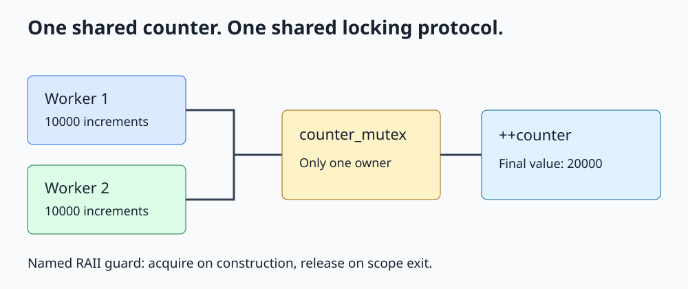

# C++ std::mutex and RAII Locks

**Protect shared invariants, and make unlocking follow object lifetime.**



Open [the diagram](../images/std_mutex.svg). The complete runnable example is [std_mutex.cpp](../cpp_examples/std_mutex.cpp).

## 1. Why is a shared increment unsafe?

`++counter` looks like one statement, but it reads the old value, calculates a new value, and writes it back. Two unsynchronized threads doing this to an ordinary `int` create a data race. In C++, the consequence is undefined behavior, not merely an occasional wrong count.

A data race involves conflicting accesses to the same memory location, at least one a write, without the required synchronization, where the accesses are not both atomic. A broader logical race can exist even when individual accesses are synchronized: checking a balance under one lock and updating it under a later lock can still use an obsolete check.

We need to protect the entire operation or invariant, not just the final assignment.

## 2. The checked counter example

The example launches two tasks, each executing this loop:

```cpp
for (int iteration = 0; iteration < 10000; ++iteration)
{
    std::lock_guard<std::mutex> guard(counter_mutex);
    ++counter;
}
```

Only one thread can own `counter_mutex` at a time. Constructing `guard` acquires it; leaving the iteration destroys `guard` and releases it. Both tasks access the same counter through the same mutex.

Starting at zero, two groups of 10000 increments produce exactly 20000. The final count is checked after both futures complete. Explicit `std::launch::async` requests concurrent execution; futures also handle task exceptions and lifetime in this small example.

An unlock synchronizes with a subsequent successful lock of the same mutex. This supplies visibility for the protected data as well as mutual exclusion.

## 3. Choose the ownership wrapper

All the mutex and lock types here are declared in `<mutex>`.

| Wrapper | Typical use | Important property |
|---|---|---|
| `std::lock_guard` | One mutex for one lexical scope | Simple; no early unlock or move |
| `std::unique_lock` | Deferred acquisition, early unlock, condition-variable wait | Movable; tracks whether it owns the mutex |
| `std::scoped_lock` | One or several mutexes for a scope | C++17; coordinated acquisition for multiple mutexes |

These objects do not contain the protected data. They refer to mutexes that must outlive them. Name the wrapper: a temporary guard destroyed at the end of a statement cannot protect the following statements.

## 4. Why RAII matters

RAII ties resource release to destruction. For example:

```cpp
std::lock_guard<std::mutex> guard(counter_mutex);
if (counter == 20000)
{
    return;
}
```

This function-body fragment releases the mutex even on the early return. Stack unwinding after an ordinary exception also destroys an owning guard. Manual `lock()` followed by `unlock()` is easy to break when another exit path is added.

RAII releases the lock; it does not undo partial changes to the protected data. If an operation can throw after half an update, preserving the invariant requires an additional exception-safety strategy.

## 5. unique_lock and early release

```cpp
std::unique_lock<std::mutex> snapshot_lock(counter_mutex);
const int snapshot = counter;
snapshot_lock.unlock();
```

The lock protects copying the shared value. Printing the private snapshot needs no lock, so the critical section ends before output. The wrapper now knows it is non-owning and will not unlock twice.

The final snapshot in this particular program is already safe after the workers finish; the explicit lock illustrates the pattern needed for a snapshot taken while writers are active.

`std::defer_lock` constructs a non-owning wrapper; `std::try_to_lock` attempts acquisition without waiting. With `std::adopt_lock`, the caller must already own the mutex. Supplying that tag does not acquire or verify ownership.

## 6. Multiple mutexes and recursive mutexes

The account section uses:

```cpp
std::scoped_lock guards(first_mutex, second_mutex);
first_balance -= 50;
second_balance += 50;
```

It acquires both distinct mutexes using deadlock avoidance and releases them at scope exit. This section is a simple single-threaded syntax demonstration; the existing [std::lock lesson](Std_Lock_Guide.md) explains competing transfers. Do not pass the same non-recursive mutex twice.

`std::recursive_mutex` permits repeated locking by the same thread, with a matching unlock required for each successful acquisition. It does not solve lock-order deadlocks between threads. Often the cleaner design is a locked public function calling a private helper that assumes the lock is already held.

## 7. Build and expected output

From the repository root:

```sh
mkdir -p /tmp/cpp-threading
g++ -std=c++17 -Wall -Wextra -Wpedantic -pthread threading/cpp_examples/std_mutex.cpp -o /tmp/cpp-threading/std_mutex
/tmp/cpp-threading/std_mutex
```

```text
Counter: 20000
Balances: 450, 650
```

Exit code `0` checks both the count and the balance update. This teaching program is not a mutex-performance benchmark.

## 8. Mistakes and explained answers

**Can readers ignore the mutex because they do not change anything?** No. A read racing with a write is still a data race.

**Would a different mutex for each worker help?** No. Mutual exclusion requires the participants to coordinate through the same mutex protecting the same state.

**Should a guard cover a slow network request or unknown callback?** Usually not. Long critical sections increase contention, and callbacks may acquire more locks. Copy the necessary data, unlock, and do independent work when the invariant permits it.

**Does a mutex guarantee fairness?** No. Deadlock, starvation, and poor throughput are different concerns. Keep critical sections small and establish a consistent locking protocol.