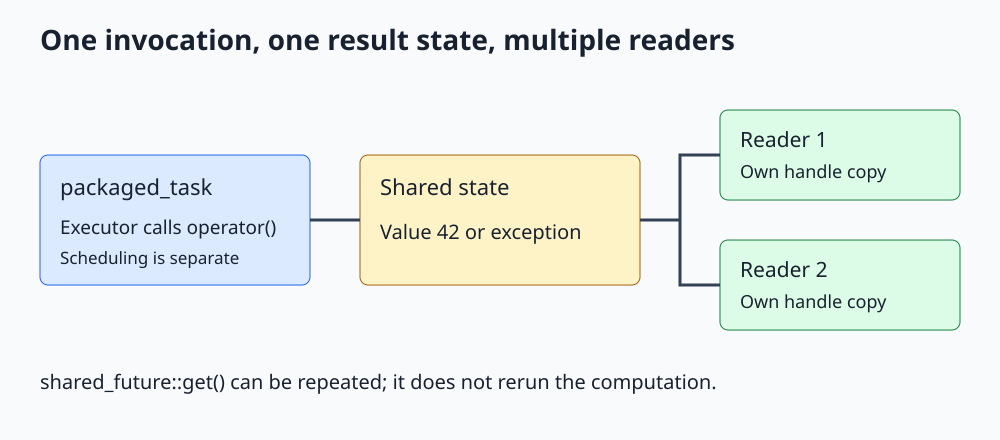

# C++ std::packaged_task and std::shared_future

**Package a callable's result channel separately from its scheduling, then share one result with several readers.**



Open [the diagram](../images/std_packaged_task.svg). The complete program is [std_packaged_task.cpp](../cpp_examples/std_packaged_task.cpp).

## 1. How does this extend promise and async?

The existing [promise/future lesson](Std_Promise_Future_Guide.md) manually publishes a value or exception. The [async lesson](Std_Async_Guide.md) combines scheduling a function with receiving its result.

`std::packaged_task` sits between them: it wraps a callable and automatically stores its return value or exception, but **does not choose when or where it runs**. This makes it useful for a task queue whose workers are managed separately.

`std::shared_future` lets several consumers observe one shared result. Both types are declared in `<future>`.

## 2. Create the task and obtain its result handle

```cpp
std::packaged_task<int()> task([] { return 6 * 7; });
std::shared_future<int> answer = task.get_future().share();
```

`int()` is a function signature: no arguments, returning an integer. Constructing `task` stores the lambda; it does not invoke it.

`get_future()` retrieves the future associated with this task's state and may be called only once for that state. `share()` transfers the future's association into a copyable shared future. The original future becomes invalid.

## 3. Scheduling remains a separate decision

```cpp
auto execution = std::async(std::launch::async, std::move(task));
```

This lesson uses the familiar async API to invoke the packaged task on a separate thread. The packaged task is move-only, so moving transfers it to the invocation machinery.

There are two distinct result channels here:

| Handle | Type | What it reports |
|---|---|---|
| `answer` | `shared_future<int>` | Wrapped callable's integer result or exception |
| `execution` | `future<void>` | Completion of invoking the packaged task |

The wrapper's call operator returns void; it stores the wrapped function's result in its own shared state. In a real thread pool, workers would invoke queued packaged tasks directly, avoiding a fresh `async` launch per task.

## 4. Two readers, one computation

```cpp
auto first_reader = std::async(std::launch::async, [answer] { return answer.get(); });
auto second_reader = std::async(std::launch::async, [answer] { return answer.get(); });
```

Each lambda captures its own copy of the shared-future handle. Both handles refer to the same shared state, so the calculation runs once and both readers receive 42.

Unlike `future::get()`, `shared_future::get()` does not consume the handle. Main can call it again after the readers finish.

For a value type such as `int`, shared-future `get()` returns a const reference to the stored value. The lambdas here return integers by value, copying that result. Do not retain a reference after the shared state is destroyed.

## 5. Exceptions are stored automatically

The second task deliberately throws:

```cpp
std::packaged_task<int()> failing_task([]() -> int
{
    throw std::runtime_error("Task failed");
});
auto failure = failing_task.get_future();
failing_task();
```

Calling it directly runs it on main's thread. The wrapped exception is captured in the shared state rather than escaping this invocation. `failure.get()` rethrows it for the consumer.

The packaged-task call itself can still report API errors, for example invoking an invalid task or trying to satisfy an already satisfied state. Do not interpret exception storage as "no operation involving this wrapper can throw."

## 6. Ownership, abandonment, and reset

If an uninvoked packaged task with an outstanding result state is destroyed, a waiting future observes `std::future_error` with `broken_promise`. A task queue must decide whether shutdown executes queued tasks or abandons them with a documented failure policy.

Normally a packaged task is invoked once per associated state. `reset()` creates a fresh state for reusing its callable; obtain a new future for that state. Do not reset or invoke the same wrapper concurrently without a suitable synchronization protocol.

Sharing a future does not make a pointed-to object thread-safe. A `shared_future<std::shared_ptr<MutableObject>>` shares a pointer result, not permission to mutate the pointee concurrently.

## 7. Future waits and deadlock

A future represents a dependency. A worker that waits for a queued child task can deadlock a fixed-size pool if all workers are waiting and none can execute the child tasks.

Also avoid holding a mutex across `get()` if the producing task needs that mutex. Result channels do not remove the need to analyze who can make progress.

## 8. Build and expected output

From the repository root:

```sh
mkdir -p /tmp/cpp-threading
g++ -std=c++17 -Wall -Wextra -Wpedantic -pthread threading/cpp_examples/std_packaged_task.cpp -o /tmp/cpp-threading/std_packaged_task
/tmp/cpp-threading/std_packaged_task
```

```text
Task error: Task failed
Reader results: 42, 42
Read again: 42
```

Exit code `0` verifies both consumers, repeated reading, and exception delivery. Only main prints, so task scheduling cannot interleave the output.

## 9. Check your understanding

**Does constructing a packaged task launch a thread?** No. Calling its call operator executes it wherever that invocation happens.

**Can two readers each call get() on one ordinary future?** No. An ordinary future is a single-consumer handle. Convert to shared_future and give each thread its own handle copy.

**Does copying a shared future rerun the task?** No. It shares the existing result state, not the computation's scheduling.