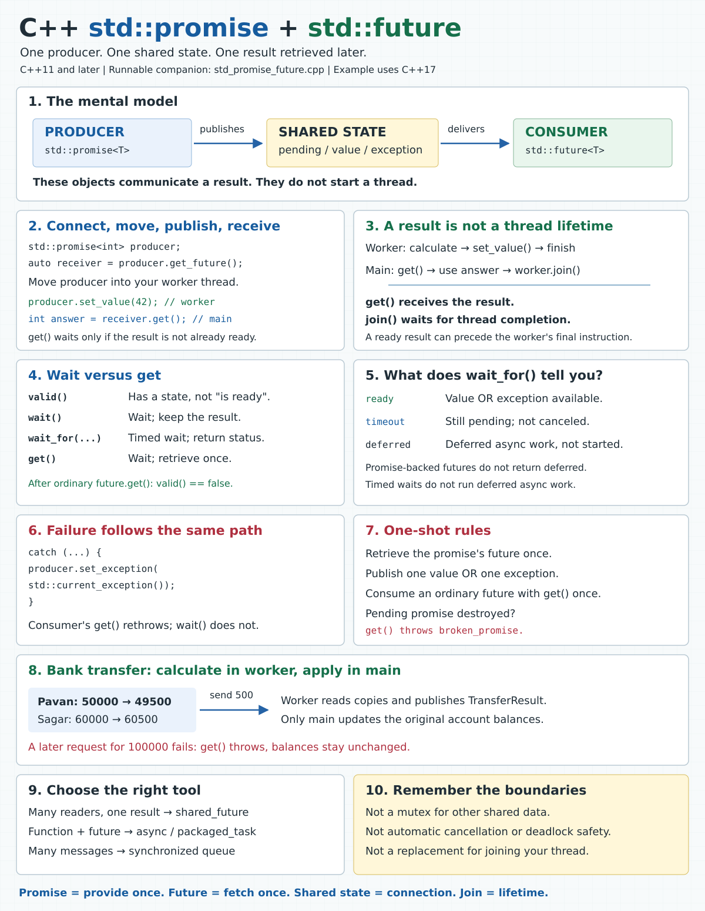

# C++ std::promise and std::future

**One producer delivers one result. One consumer retrieves it later.**



Open [the infographic](../images/std_promise_future.svg) for a larger view. The runnable example is [std_promise_future.cpp](../cpp_examples/std_promise_future.cpp).

## 1. Why do we need these?

In [std_lock.cpp](../cpp_examples/std_lock.cpp), two threads directly modify shared accounts, so they must lock the accounts before accessing shared balances.

A different problem is: **How can a worker send a calculated result, or a failure, back to the main thread?** A thread function's return value is not delivered by `std::thread::join()`. Joining waits for the thread to finish; it does not return the function's result.

You can receive a result without promise/future. If main can wait for the worker to finish, a shared variable plus `join()` is enough. If main needs to wait for result readiness separately from thread completion, you can build a communication mechanism with a mutex, condition variable, and exception storage. A promise/future pair already provides that one-time result channel.

| Part | Responsibility | Bank example |
|---|---|---|
| `std::promise<T>` | Producer supplies a value of type `T`, or an exception | Worker supplies calculated balances |
| Shared state | Holds the pending result, then the value or exception | Stores `TransferResult` |
| `std::future<T>` | Consumer waits for and retrieves the result | Main receives the balances |
| `std::thread` | Executes the worker concurrently | Runs the calculation |

Neither a promise nor a future creates a thread. They can even be used in one thread, provided you do not wait before that same thread has supplied the result.

### 1.1. Without promise/future: shared variable plus join()

Start with a simple task: a worker calculates Pavan's remaining balance after sending `500`. Main needs to receive and print that balance.

This is a complete program with **no promise, future, or mutex**:

```cpp
#include <iostream>
#include <thread>

int main()
{
    int remaining_balance = 0;

    std::thread worker([&remaining_balance]
    {
        remaining_balance = 50000 - 500;
    });

    worker.join();
    std::cout << "Remaining balance: " << remaining_balance << '\n';
}
```

Output:

```text
Remaining balance: 49500
```

How does the value reach main?

1. Main creates `remaining_balance`, which stays alive until main exits.
2. `[&remaining_balance]` captures that variable by reference. The worker writes main's actual variable, not a separate copy.
3. `worker.join()` waits until the worker finishes. Successful joining also synchronizes with thread completion, making the worker's earlier writes visible to main.
4. Main reads `remaining_balance` only after joining. There is no concurrent read/write, so this example does not need a mutex.

**The value comes through the shared variable, not through the return value of `join()`.** Main could also do unrelated work before joining, provided it does not access `remaining_balance` while the worker might write it.

For this small requirement, the manual approach is straightforward. Promise/future is not mandatory and is not automatically better.

What would be unsafe? Moving the print before `join()` without adding synchronization:

```cpp
std::cout << remaining_balance; // Unsafe here if the worker might still write it.
worker.join();
```

This is not merely a chance of printing the old value. An unsynchronized read and write of the same non-atomic variable in different threads is a **data race**, which gives undefined behavior. Sleeping before the read does not fix it. Neither does adding `volatile`.

### 1.2. Where does the manual approach become difficult?

Now add these requirements:

- Main should receive the answer as soon as it is ready, even if the worker has more work before exiting.
- Main should sleep while waiting instead of repeatedly checking a variable.
- The worker should report an insufficient-balance exception to main.
- Both success and failure must wake main reliably.

`join()` alone cannot express "wait for the result, but not necessarily thread exit." It also has no timed-wait interface and does not transport worker exceptions. We must build the missing result channel ourselves.

The next complete program uses a **mutex + condition variable + readiness flag + result variable + exception pointer**:

```cpp
#include <condition_variable>
#include <exception>
#include <iostream>
#include <mutex>
#include <stdexcept>
#include <thread>

int main()
{
    const int initial_balance = 50000;
    const int amount = 500;
    int remaining_balance = 0;
    bool ready = false;
    std::exception_ptr failure;
    std::mutex result_mutex;
    std::condition_variable result_available;

    std::thread worker([&]
    {
        int calculated_balance = 0;
        std::exception_ptr calculation_failure;

        try
        {
            if (amount > initial_balance)
            {
                throw std::runtime_error("Insufficient balance");
            }
            calculated_balance = initial_balance - amount;
        }
        catch (...)
        {
            calculation_failure = std::current_exception();
        }

        {
            std::lock_guard<std::mutex> lock(result_mutex);
            remaining_balance = calculated_balance;
            failure = calculation_failure;
            ready = true;
        }
        result_available.notify_one();
    });

    {
        std::unique_lock<std::mutex> lock(result_mutex);
        result_available.wait(lock, [&ready] { return ready; });
    }

    try
    {
        if (failure)
        {
            std::rethrow_exception(failure);
        }
        std::cout << "Remaining balance: " << remaining_balance << '\n';
    }
    catch (const std::exception& error)
    {
        std::cout << "Calculation failed: " << error.what() << '\n';
    }

    worker.join();
}
```

With `amount = 500`, the output is `Remaining balance: 49500`. Change it to `100000`, rebuild, and the output becomes `Calculation failed: Insufficient balance`.

This is a small communication example, not full transfer validation; it assumes a positive amount and only calculates the sender's balance.

Here is why each extra piece is necessary:

| Manual piece | Why it exists | What can go wrong if omitted or misused? |
|---|---|---|
| `remaining_balance` | Stores the computed value | Main needs storage that outlives the worker's access |
| `failure` | Stores an exception instead of a successful answer | An exception escaping the worker terminates the program; main cannot catch it directly |
| `ready` | Records that either a value or an exception has been published | Main cannot distinguish an initial value from a completed calculation |
| `result_mutex` | Protects publication and checking of the shared state | Unsynchronized accesses can race |
| `result_available` | Lets main sleep until the state may have changed | Polling wastes CPU; notification alone does not store readiness |
| Predicate in `wait()` | Checks `ready` under the mutex before and after waiting | A spurious wakeup could be mistaken for completion; an earlier notification could be missed |
| `notify_one()` on both outcomes | Wakes the waiting consumer after publication | A missing notification can leave an already-waiting main blocked |
| `join()` | Keeps captured variables alive until the worker finishes and handles thread lifetime | A joinable thread's destructor terminates the program |

**Does main hold the mutex while sleeping?** No. `wait(lock, predicate)` checks the predicate while locked. If it must wait, it atomically releases the mutex and starts waiting. Before checking the predicate again, it reacquires the mutex. The worker can therefore acquire the mutex and publish its answer.

**What if the worker notifies before main starts waiting?** `ready` is already true. Main checks the predicate and does not go to sleep. A condition variable does not remember notifications; the shared predicate remembers the condition.

**Why can main read `failure` and `remaining_balance` after releasing its lock?** The wait has observed publication under the same mutex, and the worker never modifies those fields again. This is a one-time publication protocol. Reusing the fields for later results would require additional synchronization.

The wait is tied to publication, not thread exit. The worker could do unrelated cleanup after `notify_one()`, and main could already process the answer. The example still joins before leaving main. As with the other C++17 examples, a general-purpose version should use an RAII joining guard if additional code might throw before the explicit join.

### 1.3. What promise/future removes, and what it does not

Compare the responsibilities, not just the line count:

| Requirement | Manual result channel | Promise/future |
|---|---|---|
| Supply the answer | Store the value, set `ready`, notify | `promise.set_value(answer)` |
| Supply an error | Capture exception, store it, set `ready`, notify | `promise.set_exception(std::current_exception())` |
| Wait and receive | Lock, wait with predicate, check error, read result | `future.get()` |
| Wait with a timeout | Condition-variable timed wait with a predicate | `future.wait_for(duration)` |
| Producer abandons the result | Design a shutdown flag and wakeup path | Destruction of a pending promise stores `broken_promise` |
| Reject a second publication | Implement a state check | A second publication throws `promise_already_satisfied` |
| Manage worker lifetime | Join or use a suitable joining wrapper | Still join or use a suitable joining wrapper |

Promise/future packages the storage, synchronization, readiness, and error-delivery protocol. You still need to catch exceptions in an ordinary `std::thread` worker and publish them explicitly; simply creating a promise does not do that automatically.

**Choose shared variable + `join()`** when main only needs the answer after the worker finishes. Even exception delivery can stay simple in this case: the worker can store an `exception_ptr`, and main can inspect it after joining, without adding a condition variable.

**Choose promise/future** when you want an explicit one-time result channel with value/error delivery and independent waiting for readiness. Choose a condition variable when you need a more general or repeated shared-state protocol.

The difficulty is not "getting an integer from a thread is impossible." It is **correctly implementing all the waiting, publication, error, and lifetime rules once the requirements grow**.

## 2. The smallest complete example

```cpp
#include <future>
#include <iostream>
#include <thread>
#include <utility>

int main()
{
    std::promise<int> answer_promise;
    std::future<int> answer_future = answer_promise.get_future();

    std::thread worker([](std::promise<int> producer)
    {
        producer.set_value(42);
    }, std::move(answer_promise));

    int answer = answer_future.get();
    worker.join();
    std::cout << answer << '\n';
}
```

Output: `42`.

Step by step:

1. `std::promise<int>` creates the producer endpoint and a shared state for an integer result.
2. `get_future()` retrieves the consumer endpoint connected to that same state. Call it only once for a given promise state.
3. `std::move(answer_promise)` transfers the producer endpoint to the worker. Promises are movable, not copyable. Do not publish through the moved-from promise.
4. `set_value(42)` stores the answer and makes the state ready.
5. `get()` waits if needed, retrieves `42`, and leaves this ordinary future invalid.
6. `join()` waits for the actual thread to finish and releases its joinable-thread responsibility.

The worker may publish before or after main calls `get()`. Both orders work. There is no requirement to add a sleep.

The minimal snippet assumes the worker successfully supplies its integer. In code that can throw, catch producer exceptions and ensure the worker is joined on the consumer's exception path too, as the runnable bank example does.

## 3. Follow the shared state

```text
Main / consumer                  Shared state                 Worker / producer
----------------                 ------------                 -----------------
promise.get_future() ----------> pending
move promise to worker -------------------------------------> owns promise
future.get() ------------------> waits
                                 value <--------------------- set_value(result)
get() returns result <---------- ready
future is now invalid
worker.join() ----------------------------------------------> wait for thread exit
```

The two endpoint objects do not contain two independent copies of a communication channel. They refer to the same shared state, whose lifetime is managed by the library.

Publishing the result synchronizes with a waiting operation that successfully detects readiness. Work performed before publication is visible to the receiving thread after that synchronization. This is why the consumer can safely receive the stored result without adding its own mutex around the shared state.

**That guarantee does not protect arbitrary shared objects from concurrent writes.** If two workers update the original account balances, you still need an appropriate locking or other synchronization design.

## 4. Bank transfer: value delivery

The example starts with Pavan holding `50000` and Sagar holding `60000`. The requested transfer is `500` from Pavan to Sagar.

```cpp
struct TransferResult
{
    int from_balance;
    int to_balance;
};
```

The worker receives **copies** of the accounts and calculates:

```cpp
result_promise.set_value({from.balance - amount, to.balance + amount});
```

The main thread receives the result and updates its own accounts:

```cpp
TransferResult result = result_future.get();
from.balance = result.from_balance;
to.balance = result.to_balance;
```

The resulting balances are Pavan `49500` and Sagar `60500`. The total stays `110000`.

Here, main runs transfers one at a time and is the only thread accessing the original balances during each calculation. No account mutex is needed for this particular ownership model. This is not a complete banking system: overlapping requests based on stale snapshots would need a different design, and production code would also validate arithmetic limits and account identity.

## 5. Exceptions travel through the same channel

Suppose the next requested transfer is `100000`, but Pavan has only `49500`.

```cpp
// Inside the worker's try block:
if (from.balance < amount)
{
    throw std::runtime_error("Insufficient balance in " + from.name + "'s account");
}
```

An exception does not automatically jump from one thread to another. If it escapes the entry function of a `std::thread`, the program calls `std::terminate()`.

The worker catches the exception and publishes it:

```cpp
catch (...)
{
    result_promise.set_exception(std::current_exception());
}
```

`std::current_exception()` captures the active exception as an `std::exception_ptr`. `set_exception()` stores it in the shared state and makes that state ready, just as `set_value()` does for a value.

In main, `get()` rethrows the stored exception:

```cpp
try
{
    TransferResult result = result_future.get();
    from.balance = result.from_balance;
    to.balance = result.to_balance;
}
catch (const std::exception& error)
{
    std::cout << "Transfer failed: " << error.what() << '\n';
}
worker.join();
```

Because `get()` throws before the assignments, the original balances remain unchanged. The ordinary future is consumed even when `get()` rethrows the stored exception. The catch allows execution to reach `join()` on this demonstrated failure path.

For general C++17 code, use an RAII joining guard when other operations between thread creation and joining might throw. C++20 offers `std::jthread`, which automatically joins on destruction; neither approach makes an unhandled exception escaping a worker safe.

## 6. Waiting is not retrieving

| Operation | Waits? | Retrieves the result? | Consumes an ordinary future? |
|---|---|---|---|
| `valid()` | No | No; checks for an associated state | No |
| `wait()` | Until ready | No | No |
| `wait_for(duration)` | Until ready or a timeout | No; returns a status | No |
| `wait_until(deadline)` | Until ready or a timeout | No; returns a status | No |
| `get()` | Until ready, if necessary | Returns the value or rethrows the exception | Yes |

**Valid and ready mean different things.** A future may be valid while its producer is still working. Use a timed wait with zero duration to check readiness without a deliberate blocking wait:

```cpp
auto status = result_future.wait_for(std::chrono::milliseconds(0));
if (status == std::future_status::ready)
{
    // A value OR an exception is available; get() distinguishes them.
}
```

Only call waiting operations on a valid future.

The runnable example waits for `10 ms` while the worker has an artificial `80 ms` delay. It usually reports a timeout first, but thread scheduling can make the result ready before main checks. No correctness decision depends on seeing that message. Timed waits can also return later than the requested duration because of scheduling.

`wait_for()` can return:

- `ready`: a value or exception is available.
- `timeout`: the result was not ready when the timed wait expired. The work is not canceled; the future is still usable.
- `deferred`: the result comes from deferred work, such as `std::async(std::launch::deferred, ...)`. A timed wait does not execute that work. This status does not occur for the promise-backed futures in this example.

`wait()` and timed waits do not rethrow the producer's stored exception. `get()` does.

## 7. One-shot rules and common mistakes

| Action | Outcome |
|---|---|
| Call `promise.get_future()` twice for the same state | Throws `std::future_error` with `future_already_retrieved` |
| Publish twice, including value then exception | Throws `std::future_error` with `promise_already_satisfied` |
| Destroy a pending promise | Makes its state ready with a `broken_promise` exception |
| Call `get()` on an ordinary future, then call it again | Invalid usage; do not rely on a guaranteed exception |
| Call `wait()` on a default-constructed or consumed future | Invalid usage; it has no associated state |
| Keep a promise alive but never fulfill it | A consumer waiting for its result may wait indefinitely |
| Destroy a joinable `std::thread` | Calls `std::terminate()` |

Many implementations diagnose some invalid-future operations with `no_state`, but portable code must not rely on that: check ownership and obey the valid-state preconditions.

An ordinary `std::future` and a `std::promise` are move-only. This helps express ownership, but does not make concurrent operations on the same endpoint object generally safe. The normal pattern is one producer owning its promise and one consumer owning its future.

## 8. Broken promise: the producer disappears

```cpp
std::future<int> receiver;
{
    std::promise<int> sender;
    receiver = sender.get_future();
} // Pending promise destroyed: stores broken_promise in the shared state.

try
{
    receiver.get();
}
catch (const std::future_error& error)
{
    if (error.code() == std::make_error_code(std::future_errc::broken_promise))
    {
        std::cout << "Producer disappeared without providing a result\n";
    }
}
```

This does not hang: destroying the pending promise makes the state ready with an exception. Destroying a promise **after** it supplied a value does not erase that value; the future can still retrieve it.

A promise-backed future's destructor does not join the worker. Some futures returned by `std::async` have special waiting behavior on destruction; do not generalize that behavior to promise-backed futures.

## 9. Related tools: choose the job first

| Tool | Use it when... | Key distinction |
|---|---|---|
| `std::promise<T>` + `std::future<T>` | Your own worker or callback will supply one result | You control publication and execution separately |
| `std::async` | You want a function invocation and a future together | Use `std::launch::async` to require asynchronous execution; default policy may defer |
| `std::packaged_task` | You want a callable that stores its return value or exception in a future state | Wrapping it does not start a thread |
| `std::shared_future<T>` | Several consumers need the same completed result | Copyable; `get()` can be repeated |
| Mutex / `std::lock` | Threads access and modify shared mutable data | Protects access, not result delivery |
| A synchronized queue | A producer sends many separate results | A promise is one-shot, not a stream |

Convert an ordinary future to a shared future with `auto shared = result_future.share();`. The original future becomes invalid. Pass copies of the shared future to consumers. For non-reference, non-void `T`, `shared_future<T>::get()` returns `const T&`; keep the owning shared state alive while using that reference.

For a completion signal with no payload, use `std::promise<void>` and `std::future<void>`. The producer calls `set_value()` without an argument, and the consumer's `get()` waits and checks for exceptions without returning a value.

Promise/future does **not** guarantee freedom from deadlock. For example, main can hold a mutex while calling `get()`, while the producer needs that mutex before it can call `set_value()`. Both then wait. Avoid waiting while holding a resource the producer needs.

## 10. Build, run, and read the output

From the workspace root:

```sh
mkdir -p out
g++ -std=c++17 -Wall -Wextra -pthread threading/std_promise_future.cpp -o out/std_promise_future
./out/std_promise_future
```

Typical output:

```text
Request: Pavan -> Sagar, amount = 500
Not ready yet; main can do other work before get().
Transfer applied by main.
Future valid after get(): false
Pavan: 49500, Sagar: 60500

Request: Pavan -> Sagar, amount = 100000
Not ready yet; main can do other work before get().
Transfer failed: Insufficient balance in Pavan's account
Future valid after get(): false
Pavan: 49500, Sagar: 60500

Broken promise: producer was destroyed without providing a result.
```

The timeout messages are scheduling-dependent. The final balances are not. The program returns a nonzero exit status if its final balances differ from the expected values.

## 11. Check your understanding

**Does `get_future()` start the worker?** No. It retrieves an endpoint. `std::thread` starts the worker in this example.

**What if the producer finishes before the consumer calls `get()`?** The shared state retains the result. The later `get()` retrieves it without waiting for publication.

**Does `ready` mean success?** No. Both a value and a stored exception make the state ready. `get()` returns the former or rethrows the latter.

**Can I use one promise for ten transfer results?** No. Use a new pair for each operation, or a synchronized queue for repeated messages.

**Can I remove `join()` because `get()` already returned?** No. The thread may still be executing after publication, and its `std::thread` object remains joinable even after the thread has finished.

**Does a timed-out wait stop the transfer?** No. Timeout affects only the wait. Cancellation needs a separate cooperative protocol.

**Why is there no account mutex here?** The worker reads copies and main alone applies the returned balances. If both threads accessed the original mutable balances concurrently, this design would need additional synchronization.

**Memory hook:** promise = provide once; future = fetch once; shared state = connection; join = thread lifetime.