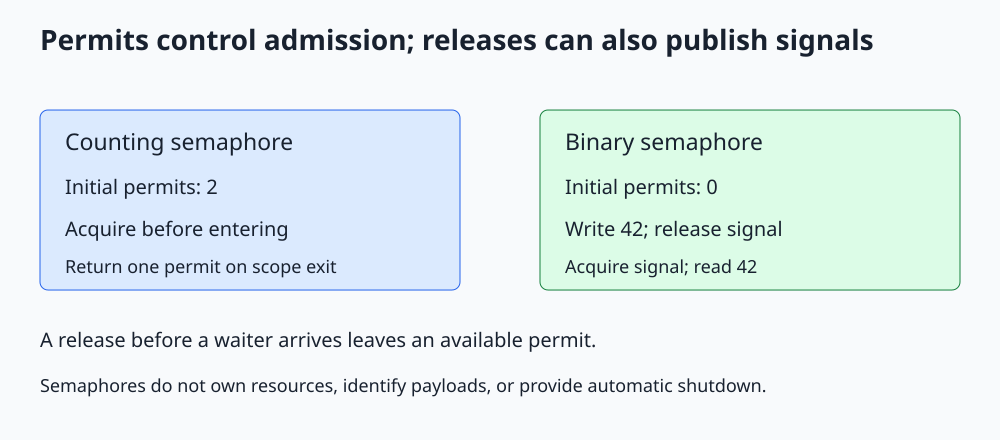

# C++ std::counting_semaphore and std::binary_semaphore

**Represent available permits or remembered signals with an atomic counter.**



Open [the diagram](../images/std_semaphore.svg). The complete C++20 program is [std_semaphore.cpp](../cpp_examples/std_semaphore.cpp).

## 1. Why use permits?

Suppose an application can use two database connections at a time. A mutex permits one owner, while a semaphore can permit two operations to enter a region simultaneously.

`std::counting_semaphore`, from `<semaphore>`, maintains a nonnegative permit count. `acquire()` waits until it can decrement that count; `release()` increases it and allows blocked acquisitions to make progress.

It controls admission, not the identity of a particular connection. A real connection pool still needs a safe way to select and return individual connection objects.

## 2. The count and the template argument

```cpp
std::counting_semaphore<2> slots{2};
```

The constructor's `2` is the initial number of available permits. The template argument is the minimum maximum count the implementation must support; `max()` can be larger.

The two-concurrent-operation limit comes from starting with two permits and returning exactly one for each acquired permit. It does not come from a template argument that magically rejects every excess release.

Never release beyond the semaphore's permitted maximum count. Treat acquire/release balance as a resource invariant.

## 3. RAII for permits

The companion program uses a small non-copyable `Permit` wrapper:

```cpp
explicit Permit(std::counting_semaphore<2>& slots) : slots_(slots)
{
    slots_.acquire();
}

~Permit()
{
    slots_.release();
}
```

An owning permit is returned at scope exit. Copying is disabled because two destructors must not release one acquired permit twice.

Four async tasks each take a permit, increment an atomic active count, check that it is at most two, decrement it, and leave the scope. The check is independent of scheduling: the maximum observed might be one or two, but must never exceed two.

The tiny work region is intentional; this is a correctness illustration, not a demonstration that two tasks necessarily overlap in a particular execution.

## 4. Binary semaphore as a remembered signal

The second part starts with zero permits:

```cpp
std::binary_semaphore ready{0};
```

Producer:

```cpp
payload = 42;
ready.release();
```

Consumer:

```cpp
ready.acquire();
const int received = payload;
```

The release/acquire synchronization publishes the earlier ordinary payload write to this consumer. If the release happens before the acquire begins, the permit remains available. This differs from a condition-variable notification, which is not a stored token.

`binary_semaphore` is an alias of `counting_semaphore<1>`. Use a binary zero/one signaling discipline and do not assume extra releases saturate harmlessly at one.

## 5. A semaphore is not an owning mutex

| Property | Mutex | Semaphore |
|---|---|---|
| Ownership | A thread owns the lock | No thread ownership of permits |
| Release | Owning thread unlocks | A different thread may release |
| Capacity | One exclusive owner | A count of available permits |
| Common purpose | Protect a shared invariant | Admission control or signaling |

In the signaling example, the producer releases without having acquired: it is publishing a signal, not returning a resource permit. Both protocols are valid, but their accounting rules differ.

Allowing two entrants does not make ordinary shared data inside that region safe for both to mutate. Our active counter is atomic for that reason.

## 6. Try operations, shutdown, and fairness

`try_acquire()`, `try_acquire_for()`, and `try_acquire_until()` support unsuccessful attempts. Try operations may fail spuriously. Timed return is not a hard real-time guarantee.

The standard semaphore does not have `close()` or a stop-token acquire overload. A blocked acquire needs a designed completion path; destroying the semaphore or merely requesting stop on a jthread does not unblock it safely.

A sentinel-work protocol, timed cancellation checks, or a predicate-based queue can be more appropriate for application shutdown. No fairness or starvation-freedom guarantee should be inferred from the permit count.

## 7. Build and expected output

From the repository root:

```sh
mkdir -p /tmp/cpp-threading
g++ -std=c++20 -Wall -Wextra -Wpedantic -pthread threading/cpp_examples/std_semaphore.cpp -o /tmp/cpp-threading/std_semaphore
/tmp/cpp-threading/std_semaphore
```

```text
Limit respected: true
Completed tasks: 4
Published value: 42
```

Exit code `0` checks the admission bound, that no active operations remain, and the published payload.

## 8. Check your understanding

**Why is the permit wrapper non-copyable?** Copying ownership would produce excess releases, corrupting the permit count.

**Can another thread release a semaphore?** Yes. That is essential for the producer-to-consumer signaling example.

**Does releasing a permit enqueue an associated payload object?** No. The count carries availability, not data identity. A multi-item producer/consumer system still needs a properly synchronized buffer.