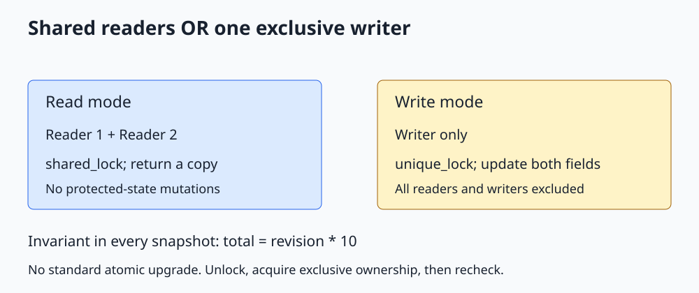

# C++ std::shared_mutex

**Allow concurrent readers while preserving exclusive access for writers.**



Open [the diagram](../images/std_shared_mutex.svg). The complete runnable program is [std_shared_mutex.cpp](../cpp_examples/std_shared_mutex.cpp).

## 1. Why distinguish readers and writers?

A cache or configuration table may have many reads and few writes. A plain mutex permits only one access at a time, including reads that could safely coexist.

C++17 `std::shared_mutex`, declared in `<shared_mutex>`, has shared and exclusive ownership modes. Multiple shared owners may coexist. An exclusive owner excludes every other owner.

This is useful only when readers truly do not mutate protected state. Calling a method named `read()` does not make its implementation read-only.

## 2. Protect an invariant, not just a field

Our ledger stores two integers:

```cpp
struct Snapshot
{
    int revision;
    int total;
};
```

The invariant is `total == revision * 10`. A reader must see one consistent pair, never a revision from one update and a total from another.

Making the fields separate atomics would prevent ordinary races on each field, but would not guarantee this pairwise invariant. One lock protects the entire snapshot.

## 3. Reader path

```cpp
Snapshot read() const
{
    std::shared_lock<std::shared_mutex> lock(mutex_);
    return state_;
}
```

`std::shared_lock` acquires shared ownership and releases it at scope exit. The return copies the snapshot while the lock is still alive. Callers then use their independent copy without a lock.

The mutex is `mutable` so a logically const read operation can perform synchronization. This does not make the ledger state mutable or authorize modification under a shared lock.

Returning a reference or pointer to `state_` would be unsafe after the guard is destroyed if writers can run. Locking inside a getter does not protect later use of an escaped reference.

## 4. Writer path

```cpp
void update(int revision)
{
    std::unique_lock<std::shared_mutex> lock(mutex_);
    state_ = {revision, revision * 10};
}
```

`unique_lock` acquires exclusive ownership. Both fields change during the same ownership period. Readers cannot observe the operation halfway through.

The example uses revisions 1 through 1000, so multiplication stays within the integer range. A general ledger would need its own domain validation.

## 5. Ownership combinations

| Current owner | New shared reader | New exclusive writer |
|---|---|---|
| Nobody | May acquire | May acquire |
| One or more readers | May acquire subject to implementation scheduling | Must wait |
| Writer | Must wait | Must wait |

The API does not promise fairness, reader priority, or writer priority. A read-heavy workload can have very different writer latency across implementations.

A thread should not try to take a second ownership of the same `shared_mutex` while already owning it. It is not a recursive mutex.

## 6. There is no atomic upgrade operation

The standard `shared_mutex` interface does not provide an atomic shared-to-exclusive upgrade. Trying to lock exclusively while retaining your shared lock is not a valid upgrade pattern.

Instead, release shared ownership, acquire exclusive ownership, then **recheck the condition** that motivated the write. Another writer may have changed the state during the gap.

For a cache lookup followed by insertion, this often means: look under a shared lock; if absent, take an exclusive lock and look again before inserting.

## 7. Is it always faster than mutex?

No. Reader/writer locks have bookkeeping overhead. Very short reads, frequent writes, and high contention can make a plain mutex faster and easier to reason about.

Measure representative throughput and tail latency before choosing. Do not benchmark by printing inside critical sections: output costs can dominate the thing being measured.

`std::shared_timed_mutex` provides related timed ownership operations and is available since C++14. Shared ownership is not permission to use mutating container operations such as `map::operator[]` concurrently.

## 8. Build and expected output

From the repository root:

```sh
mkdir -p /tmp/cpp-threading
g++ -std=c++17 -Wall -Wextra -Wpedantic -pthread threading/cpp_examples/std_shared_mutex.cpp -o /tmp/cpp-threading/std_shared_mutex
/tmp/cpp-threading/std_shared_mutex
```

```text
Consistent snapshots: true
Final revision / total: 1000 / 10000
```

Two readers each check 1000 snapshots while one writer may be active. Scheduling need not produce any specific intermediate revision. Exit code `0` checks every observed invariant and the final state, not that overlap happened on a particular run.

## 9. Check your understanding

**Can a reader update a cache-hit counter under shared ownership?** Not if that counter is ordinary shared data. Use a separate suitable atomic or exclusive ownership.

**Why return a value?** The caller's copy stays valid and consistent after the lock is released.

**Does shared_lock make the referenced object const?** No. Correctness depends on the code respecting the read-only protocol; the guard cannot enforce that by itself.