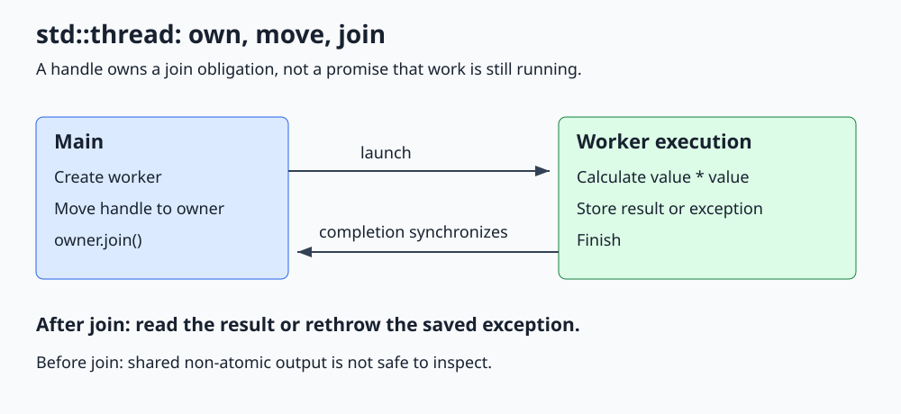

# C++ std::thread

**Start independent execution, manage its lifetime, and bring failures back to the caller.**



Open [the diagram](../images/std_thread.svg) for a larger view. The complete runnable program is [std_thread.cpp](../cpp_examples/std_thread.cpp).

## 1. Why do we need threads?

A process owns resources such as memory and open files. Threads are execution paths inside that process. They share its address space, but each has its own call stack and scheduling state.

Concurrency means tasks can make progress during overlapping periods. Parallelism means tasks actually execute simultaneously, usually on different cores. Starting two threads permits concurrency; it does not guarantee parallel execution or a speedup.

Our worker calculates a square while main owns the thread handle. A second invocation demonstrates returning a worker failure without terminating the process.

## 2. Starting a thread and passing arguments

The essential pattern in the companion program is:

```cpp
std::thread worker([&failure](int value, int& output)
{
    try
    {
        if (value < 0)
        {
            throw std::invalid_argument("Input must be nonnegative");
        }
        output = value * value;
    }
    catch (...)
    {
        failure = std::current_exception();
    }
}, input, std::ref(result));
```

`std::thread` is declared in `<thread>`. Construction starts a new execution that invokes the stored callable with its stored arguments. The operating system decides when that execution gets CPU time.

Arguments are normally copied or moved into thread-owned storage. `input` is copied, so the worker's `value` is independent. `std::ref(result)`, from `<functional>`, deliberately passes a reference to main's result instead. The lambda also captures `failure` by reference.

Both referenced objects must outlive the worker. This example joins before returning from `run_worker()`, so their lifetime is sufficient. Do not capture a local by reference and return while a detached thread still uses it.

## 3. A thread object owns a join obligation

```cpp
std::thread owner = std::move(worker);
owner.join();
```

Threads are movable, not copyable. Moving transfers the handle and responsibility to join or detach. It does not move the worker to another CPU or restart it.

| Moment | worker.joinable() | owner.joinable() |
|---|---|---|
| Before the move | true | Owner not constructed |
| After the move | false | true |
| After owner.join() | false | false |

`joinable()` describes ownership, not whether the function is still running. Even a finished thread remains joinable until joined or detached.

Destroying a joinable `std::thread` calls `std::terminate()`. Assigning a new thread into an already joinable thread also terminates. Never rely on the destructor to perform a join.

## 4. What join guarantees

`join()` blocks until the worker finishes. Successful return synchronizes with that completion: the worker's earlier writes to `result` and `failure` are visible to the joining thread.

That is why the non-atomic result is safe here:

1. Main initializes it before starting the worker.
2. Only the worker accesses it during execution.
3. Main reads it only after joining.

Reading the result before `join()` could race with the write. Waiting for a guessed amount of time would not fix that. A sleep provides neither a completion guarantee nor a synchronization relationship.

## 5. Exceptions do not cross threads automatically

An exception escaping a thread's entry function terminates the process. A `try` block around construction or `join()` cannot catch that worker exception.

The example catches inside the worker and stores `std::current_exception()` in a `std::exception_ptr`. After joining, main calls `std::rethrow_exception(failure)`. The original exception type is preserved, so main can catch `std::invalid_argument`.

The non-atomic exception pointer is safe for the same reason as the result: main reads it only after completion. For a reusable result channel, prefer the existing [promise/future lesson](Std_Promise_Future_Guide.md).

The multiplication is intentionally limited to small teaching inputs. General integer calculations need overflow handling too.

## 6. join, detach, and RAII

| Choice | Meaning | Main risk |
|---|---|---|
| `join()` | Wait and reclaim the thread's execution resources | Waiting while holding a mutex the worker needs can deadlock |
| `detach()` | Release the handle; execution continues independently | Referenced objects and process resources can disappear too early |
| `std::jthread` | C++20 RAII owner that requests stop and joins | Stop is cooperative; destruction can still block |

Detaching is not cancellation and does not keep the process alive after `main()` exits. It also removes this handle's ability to wait for completion.

The example performs no potentially throwing application work between successful construction and joining; the move itself is nonthrowing. In larger C++17 programs, use a joining scope guard or another RAII owner. If creating the second of several raw threads fails, the first must still be joined. The [jthread lesson](Std_Jthread_Guide.md) demonstrates modern ownership.

## 7. Build and expected output

From the repository root:

```sh
mkdir -p /tmp/cpp-threading
g++ -std=c++17 -Wall -Wextra -Wpedantic -pthread threading/cpp_examples/std_thread.cpp -o /tmp/cpp-threading/std_thread
/tmp/cpp-threading/std_thread
```

```text
Worker error: Input must be nonnegative
Square: 36
```

Only main prints, so line ordering is stable. Exit code `0` confirms both the successful result and exception delivery.

## 8. Check your understanding

**Can main inspect `result` once `worker.joinable()` becomes true?** No. That property says nothing about completion, and an unsynchronized read can race.

**Why not pass `result` without `std::ref`?** Thread argument storage normally decays to a value. A callable requiring a non-const `int&` cannot bind to that stored value through the usual thread invocation; `std::ref` explicitly preserves reference semantics.

**Does moving a thread synchronize its writes?** No. Ownership transfer is not completion. The successful join supplies the synchronization used here.

**What if main has nothing useful to do during this tiny calculation?** A direct function call is likely cheaper. Threads are a coordination tool, not an automatic optimization.