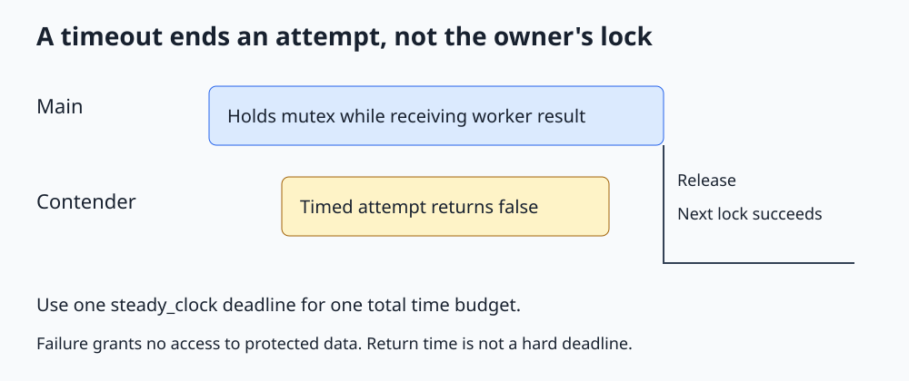

# C++ std::timed_mutex

**Treat lock acquisition failure as an expected outcome when work has a time budget.**



Open [the diagram](../images/std_timed_mutex.svg). The complete runnable example is [std_timed_mutex.cpp](../cpp_examples/std_timed_mutex.cpp).

## 1. Why use a timed lock?

A regular blocking lock can wait indefinitely. A request handler may instead need to abandon an update, serve an explicitly allowed stale snapshot, or report that a resource is busy.

`std::timed_mutex`, declared in `<mutex>`, supports ordinary exclusive ownership plus timed acquisition attempts. A failed attempt gives no permission to access the protected data.

Timeouts help a program decide what to do when it cannot acquire a lock. They do not automatically repair a broken lock-order design.

## 2. The acquisition choices

| Operation | Waiting behavior | Result |
|---|---|---|
| `lock()` | Wait until acquired, unless an error occurs | Returns owning the mutex |
| `try_lock()` | Does not wait for ownership | Boolean success |
| `try_lock_for(duration)` | Attempt within a relative time budget | Boolean success |
| `try_lock_until(deadline)` | Attempt until an absolute deadline | Boolean success |

Timed and try operations may fail spuriously. A false result is not proof that another thread continuously held the mutex for the entire interval.

Durations are not hard scheduling guarantees: contention, scheduling, and implementation overhead can make return occur after the nominal deadline. Do not assert that a ten-millisecond timeout takes exactly ten milliseconds.

## 3. A controlled contention example

Main first holds the mutex and starts a contender:

```cpp
std::unique_lock<std::timed_mutex> attempt(resource_mutex, std::defer_lock);
const auto deadline = std::chrono::steady_clock::now() + std::chrono::milliseconds(10);
return !attempt.try_lock_until(deadline);
```

The deferred wrapper initially does not own the mutex. The timed call updates its ownership state if acquisition succeeds.

Main deliberately retains its lock while receiving the contender's result. The contender cannot acquire that mutex before returning, so this check deterministically observes failure. It needs no guessed startup sleep or assumptions about which thread is scheduled first.

Waiting on a worker while holding a mutex is normally dangerous. This example does it only because the worker has a timed attempt and does not require acquisition to finish. Replacing its attempt with blocking `lock()` would create a deadlock.

## 4. After failure, do not touch protected state

A typical function-body pattern is:

```cpp
std::unique_lock<std::timed_mutex> lock(resource_mutex, std::defer_lock);
if (!lock.try_lock_for(std::chrono::milliseconds(10)))
{
    return false;
}
```

Only code after successful acquisition can use the resource. The wrapper will release ownership at scope exit, including early returns or exception unwinding after acquisition.

Retrying immediately forever defeats the timeout policy and may produce a livelock: threads keep doing work but make no useful progress. A real retry policy needs a total deadline, a limit, or another progress strategy.

## 5. Why steady_clock?

`std::chrono::steady_clock` is monotonic, so it is suitable for measuring elapsed time and deadlines. Wall-clock corrections can change `system_clock` readings.

For a multi-step operation with a total budget, calculate one deadline and reuse it. Starting a fresh ten-millisecond budget at every step can greatly exceed the intended total duration.

In the example, the budget begins inside the worker. It does not include the time spent launching or scheduling that worker before it enters the callable.

## 6. Related types and limitations

`std::recursive_timed_mutex` combines same-thread recursive ownership with timed acquisition. `std::shared_timed_mutex` adds timed reader/writer locking. More features do not remove the need to define which data each lock protects.

For waiting on queue state, use a predicate-based condition variable instead of repeatedly trying the queue's mutex. Owning the queue lock does not mean an item exists.

Timed mutex operations do not accept stop tokens. Cooperative cancellation must be designed into the surrounding protocol, perhaps through bounded retries or a stop-aware wait.

## 7. Build and expected output

From the repository root:

```sh
mkdir -p /tmp/cpp-threading
g++ -std=c++17 -Wall -Wextra -Wpedantic -pthread threading/cpp_examples/std_timed_mutex.cpp -o /tmp/cpp-threading/std_timed_mutex
/tmp/cpp-threading/std_timed_mutex
```

```text
Contended attempt failed: true
Acquired after release: true
```

The second acquisition uses ordinary blocking ownership after the contention ends. This intentionally avoids asserting that a timed try on an available mutex cannot fail spuriously. Exit code `0` checks both observations, not elapsed wall time.

## 8. Check your understanding

**Can a timeout handler read the resource to decide what happened?** Only with another valid synchronization mechanism. Failed acquisition does not authorize access.

**Does a timeout tell the owner to unlock?** No. It affects only the caller's attempt, not the owner's behavior.

**Is a timed lock a real-time scheduling guarantee?** No. Return can be delayed by scheduling; application timing guarantees require much more than this API.