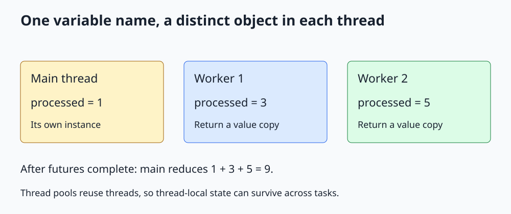

# C++ thread_local

**Give each thread a separate object instead of sharing one frequently modified object.**



Open [the diagram](../images/thread_local.svg). The complete runnable program is [thread_local.cpp](../cpp_examples/thread_local.cpp).

## 1. Why keep state per thread?

A single shared counter can become a contention point even when it is atomic. Sometimes workers do not need an immediately shared total: each can accumulate locally and return a partial result at completion.

The `thread_local` storage specifier, available since C++11, gives each thread its own instance of an object. It is a language feature, not a function requiring a special header.

Common uses include per-thread scratch buffers, random-number engines, and context for synchronous work executed on that thread. Ordinary local variables are preferable when data can simply be passed through function calls.

## 2. The complete counter mechanism

```cpp
thread_local int processed = 0;

int process_batch(int count)
{
    for (int item = 0; item < count; ++item)
    {
        ++processed;
    }
    return processed;
}
```

Every thread refers to its own `processed` when it executes this function. Main increments its instance once. One explicit async worker increments its instance three times; another increments its instance five times.

No two workers modify the same counter object, so the increments need no mutex or atomic.

## 3. One name, three different objects

| Execution | Its initial value | Work | Its final value |
|---|---|---|---|
| Main | 0 | One item | 1 |
| First async thread | 0 | Three items | 3 |
| Second async thread | 0 | Five items | 5 |

Changing main's instance to 1 does not initialize the workers' instances to 1. Each has its own initialization.

The workers return copies through futures. Main receives those copies and combines them with its own count to get 9. `thread_local` does not automatically enumerate instances or compute a global total.

## 4. Lifetime and initialization

A thread-local object's lifetime belongs to its thread. Initialization follows the language's thread-storage initialization rules; avoid depending on incidental initialization order across translation units.

Successfully initialized thread-local class objects are destroyed when their thread exits normally. Cleanup should not throw or depend on shared services that may already be shutting down.

Function-scope `thread_local` also persists across calls on the same thread. It is not reset on every entry to the function. A namespace-scope declaration, as in the example, makes the lesson's storage choice especially visible.

## 5. Thread-local is not task-local

Thread pools reuse threads. If a worker handles request A and then request B, its thread-local state remains unless explicitly reset. The second request can accidentally inherit the first request's counters, identity, or error context.

Coroutine and asynchronous continuation code can also resume on a different thread depending on its executor. Thread-local state follows the executing thread, not the logical request.

Use an explicitly passed request/context object for state whose lifetime and identity belong to a task. The [thread-pool lesson](Thread_Pool_Guide.md) explains worker reuse.

## 6. Escaping references changes the problem

If you pass the address of your thread-local object to another thread, that other thread can access the same underlying object through the pointer. The storage specifier does not make such access automatically safe.

Now you must handle synchronization and ensure the owning thread does not exit while the pointer is still used. Prefer returning a value, as the example does.

Thread-local storage also has a per-thread memory cost. A large buffer multiplied by hundreds of workers can consume significant memory.

## 7. Reduction and false sharing

A useful counting pattern is: accumulate independently, wait for completion, then reduce the returned values. This reduces synchronization frequency compared with one shared increment per item.

If instead you place per-worker counters next to each other in a shared array, different counters can share one cache line. Concurrent writes then create **false sharing** even though the logical objects are distinct and no data race exists. Padding or `std::hardware_destructive_interference_size` may help on suitable implementations, but measurement is necessary.

This example demonstrates storage isolation, not a benchmark or a portable guarantee about physical cache-line placement.

## 8. Build and expected output

From the repository root:

```sh
mkdir -p /tmp/cpp-threading
g++ -std=c++17 -Wall -Wextra -Wpedantic -pthread threading/cpp_examples/thread_local.cpp -o /tmp/cpp-threading/thread_local
/tmp/cpp-threading/thread_local
```

```text
Main thread count: 1
Worker counts: 3, 5
Combined count: 9
```

Exit code `0` checks the independent values. Explicit async launch policies provide distinct worker executions instead of possibly deferred calls on main's thread.

## 9. Check your understanding

**Would ordinary global `int processed` be equivalent?** No. It would be one shared object, and the unsynchronized increments would race.

**Would an ordinary local counter work for this calculation?** Yes, and would be simpler if nothing needed to preserve state across calls. The example deliberately uses thread-local storage to demonstrate its lifetime and identity.

**Does a new task in a pool get a fresh thread-local instance?** No. Only a new thread gets its own instance. Reused workers retain their thread-local state.