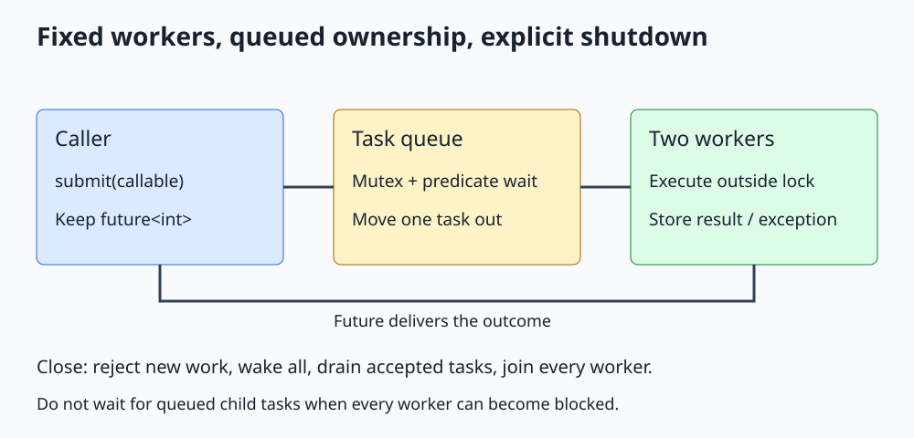

# C++ Thread Pool: Queue, Workers, Futures, and Shutdown

**Reuse a bounded number of worker threads, transfer queued task ownership, and define shutdown explicitly.**



Open [the diagram](../images/thread_pool.svg). The complete C++20 program is [thread_pool.cpp](../cpp_examples/thread_pool.cpp).

## 1. Why build a pool?

Starting one operating-system thread for every tiny operation adds launch overhead and can create far more runnable threads than the machine can use efficiently. A pool keeps a fixed group of workers and gives them tasks from a shared queue.

C++20 has no standard `std::thread_pool` class. This small teaching implementation combines the primitives from the earlier lessons; production applications should consider a mature executor or task library appropriate to their workload.

The pool deliberately accepts only copyable callables compatible with `int()`. This keeps the ownership and shutdown logic visible instead of burying it in generic callable machinery.

## 2. The state and invariant

| Member | Purpose | Protection |
|---|---|---|
| `tasks_` | Queue of move-only packaged tasks | `mutex_` |
| `closed_` | Reject future submissions and permit worker exit | `mutex_` |
| `available_` | Wake workers when tasks arrive or closing begins | Predicate evaluated under `mutex_` |
| `workers_` | Own a fixed group of jthreads | Constructed and destroyed by the pool owner |

A task is either still in the queue or owned by exactly one worker. It is moved out while the mutex is held, so two workers cannot execute the same queued wrapper.

The queue is unbounded in this lesson. Only the number of worker threads is bounded. A production pool may need the [bounded-queue backpressure protocol](Std_Condition_Variable_Guide.md) to limit pending work.

## 3. Submission creates a result channel

```cpp
std::packaged_task<int()> task(std::move(function));
auto result = task.get_future();
{
    std::lock_guard<std::mutex> lock(mutex_);
    if (closed_)
    {
        throw std::runtime_error("Pool is closed");
    }
    tasks_.push_back(std::move(task));
}
available_.notify_one();
return result;
```

The future is obtained before the wrapper moves into the queue. If enqueueing fails, the submission throws rather than returning a future for an accepted task.

The closed check and insertion share one critical section. If `submit()` races with `close()` while the pool is alive, the mutex orders them: the task is either accepted before closure or rejected after it.

The caller owns the returned future. The pool owns scheduling, and eventually a worker owns the packaged-task invocation.

## 4. Workers wait, claim one task, and unlock before executing

```cpp
available_.wait(lock, [&] { return closed_ || !tasks_.empty(); });
if (tasks_.empty())
{
    return;
}
task = std::move(tasks_.front());
tasks_.pop_front();
```

After the predicate wait, an empty queue implies closure. If work remains, a worker claims it even when `closed_` is true: that is the drain-on-shutdown policy.

The scope containing `unique_lock` ends before `task()` runs. Executing user work under the queue mutex would serialize the pool, block submissions, and risk deadlock if a task called back into the pool.

The worker repeats until closure and an empty queue occur together. Notifications are only wakeup hints; the queue and closed flag determine what it does.

## 5. Results and exceptions

A packaged task stores its callable's return value or exception in the future's shared state. Throwing `std::runtime_error` from one task does not escape the worker entry function and does not prevent other tasks from running.

The example submits squares of 1, 2, 3, and 4, one deliberately failing task, and a final task returning 99. Main checks the square sum `1 + 4 + 9 + 16 = 30` and catches the failing task's exception through `get()`.

Packaging handles exceptions from the user callable, not arbitrary failures in queue synchronization or misuse of packaged-task state. This example assumes ordinary synchronization operations succeed and invokes each valid task exactly once.

## 6. Shutdown is a two-stage operation

`close()` marks the pool closed under its mutex and notifies all waiting workers. It does **not** wait for task completion. Calls are idempotent: marking an already closed pool closed changes nothing.

The destructor calls `close()` and clears the worker vector. Destroying each joinable jthread requests stop and joins. These workers do not consume stop tokens; they exit through the queue's closed-and-empty predicate, so accepted work drains before joining completes.

The worker owners are declared after the state they use, and the destructor joins while that state is still alive. No mutex is held while joining.

The final task's future lives outside the pool's scope. Reading it after pool destruction yields 99, illustrating that the result state can outlive its executor.

## 7. Partial construction and object lifetime

The constructor rejects zero workers, reserves the vector capacity, and starts workers inside a try block. If a later thread launch fails, it closes the queue before rethrowing. Already constructed jthreads then join during member unwinding instead of waiting forever on an open empty queue.

The pool must outlive every thread that calls its methods. Synchronizing `close()` with `submit()` does not make it legal to destroy the object while another caller is still using it.

Do not destroy the pool from one of its own tasks: that would attempt to join the current worker. Captured references inside submitted tasks must likewise outlive those tasks. Capture values when they represent independent task input, as the square examples do.

## 8. Deadlock, starvation, and oversubscription

**Deadlock:** With two workers, suppose both tasks submit a child and then call `get()` on the child's future. Both workers can be blocked while both children sit in the queue. No worker is free to execute them. Avoid blocking nested dependencies in this simple pool.

**Starvation:** A task may wait indefinitely for resources or scheduling while other work progresses. A FIFO queue does not imply operating-system fairness or bounded task completion time.

**Livelock:** Threads keep retrying or yielding but do not accomplish the operation. More activity is not the same as progress.

**Oversubscription:** Several pools or per-task thread creation can produce too many runnable threads. CPU-bound work often starts near hardware concurrency, but `hardware_concurrency()` is only a hint and may return zero. Blocking I/O, workload size, and the application's other threads affect a sensible worker count.

This example uses two explicitly chosen workers. It does not provide work stealing, priorities, cancellation of running tasks, deadlines, or nested task assistance.

## 9. Build and expected output

From the repository root:

```sh
mkdir -p /tmp/cpp-threading
g++ -std=c++20 -Wall -Wextra -Wpedantic -pthread threading/cpp_examples/thread_pool.cpp -o /tmp/cpp-threading/thread_pool
/tmp/cpp-threading/thread_pool
```

```text
Square sum: 30
Task exception delivered: true
Late submission rejected: true
Result after pool destruction: 99
```

Exit code `0` also confirms zero-worker construction is rejected. Execution order is intentionally unspecified; main prints only after receiving the relevant outcomes.

## 10. Check your understanding

**Why not exit as soon as closed_ becomes true?** That would abandon accepted queued tasks instead of following the documented drain policy.

**Does close mean the last task has finished?** No. It stops admission and wakes workers. Joining during destruction establishes completion.

**Why move packaged tasks?** They own single-use result producers and are non-copyable. Moving transfers execution responsibility without creating duplicate producers.

**Can jthread's stop request interrupt a task blocked forever in user code?** No. This destructor will wait for that task. Bounded shutdown needs cooperative tasks and a cancellation-aware application protocol.

## 11. Diagnosing concurrency failures

For a hang, collect all thread backtraces and identify the dependency cycle: which thread owns each mutex, which future or gate is awaited, and who can satisfy it. A test timeout detects lack of progress but does not identify its cause.

On a platform with a supported ThreadSanitizer runtime, compile with `-fsanitize=thread -g -O1 -pthread` and run representative tests. Sanitizer availability depends on compiler, standard library, and OS; it is not assumed for this Alpine container. A clean run is useful evidence, not proof that every interleaving is correct.

Use invariant checks and repeated runs without relying on sleeps. Measure throughput and latency separately from correctness tests. Lock-free code, smaller memory orders, and additional workers are optimization choices that need evidence, not default fixes.